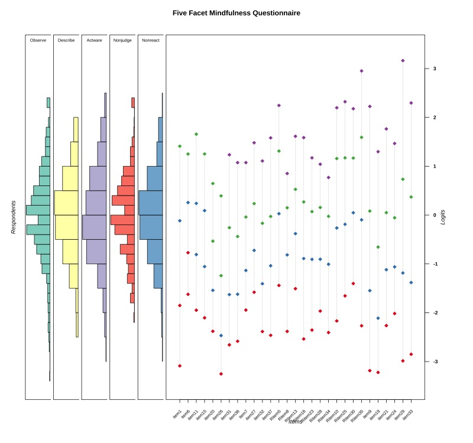

```{r setup-chunk, include=FALSE}
#This chunk sets the global chunk environment.

knitr::opts_chunk$set(dev = "png",
                      dpi = 600,
                      echo = FALSE,
                      cache = FALSE,
                      message = FALSE,
                      warning=F)
set.seed(2023)
par(family = "Arial")
# options(knitr.duplicate.label = "allow")

```

```{r pacman,  include=FALSE}
#You need to run this chunk 1X in your system 
#install.packages("pacman")#Run this if you don't have pacman installed.
# renv::restore()
pacman::p_load(MOTE, tidyverse, psych, lavaan,kableExtra,gt,gtsummary, mirt,likert,kutils,semPlot,semTable,semTools,dlookr,VIM,DiagrammeR,DiagrammeRsvg,ggplot2,cowplot,rsvg,questionr,magick, simsem,readxl, MVN)

library(gtExtras)
library(papaja)
library(papaja)
library(lordif)
library(tabledown)
library(ggsci)
papaja::r_refs("references.bib")
# renv::snapshot()

#if you dont have LaTeX installed run the following lines
# install.packages("tinytex")
# tinytex::install_tinytex()
```

---
nocite: |
  `r papaja::cite_r("references.bib")`
---

```{r samplesize, include=F}
#Simulation to estimate required sample size for CFA

lavmodel <-  "Observe =~ item1 + item6 + item11 + item15 + item20 + item26 + item31 + item36
Describe =~ item2 + item7 + Ritem12 + Ritem16 + Ritem22 + item27 + item32 + item37
Awareness =~ Ritem5 + Ritem8 + Ritem13 + Ritem18 + Ritem23 + Ritem28 + Ritem34 + Ritem38
Nonjudge =~ Ritem3 + Ritem10 + Ritem14 + Ritem17 + Ritem25 + Ritem30+ Ritem35 + Ritem39
Nonreact =~ item4 + item9 + item19 + item21 + item24 + item29 + item33" 


df <- semPower::semPower.getDf(lavmodel)
ap <- semPower::semPower.aPriori(effect = .05, effect.measure = 'RMSEA', 
                                 alpha = .05, 
                                 power = .80, 
                                 df = df) 
summary(ap)

```

```{r samplesizeIRT, eval=FALSE, message=FALSE, warning=FALSE, include=FALSE, results='hide', width=60}

#Simulation to estimate required sample size for CFA


library(SimDesign)
set.seed(222)
m <-  8 # item number
n <- c(50, 100, 200, 300, 400, 450, 500) # sample size
design <- as.data.frame(n)


irtGenerate <- function(condition, fixed_objects = FALSE) {
n <- condition$n

a <- matrix(rlnorm(m,.2,.3))
diffs <- t(apply(matrix(runif(m*4, .3, 1), m), 1, cumsum))
diffs <- -(diffs - rowMeans(diffs))
diffs<- diffs + rnorm(m)
d <- diffs
dat <- simdata(a, d, n, itemtype = 'graded')
return(dat)
}

irtAnalyze <- function(condition, dat, fixed_objects = NULL) {
mod <- mirt(dat, 1, itemtype = 'graded', verbose = FALSE)
simpars <- coef(mod, simplify = TRUE, digits = Inf)$items
irtpars <- c(a = simpars[,1], d = simpars[,2])
return(irtpars)
}

irtSummarize <- function(condition, results,
fixed_objects = NULL) {
apop <- fixed_objects['alpha', ]
dpop <- fixed_objects['d', ]
simrmse <- RMSE(results, c(apop, dpop))
out <- c(RMSE = simrmse)
return(out)
}


simres <- runSimulation(design, replications = 100,
parallel = TRUE, generate = irtGenerate,
analyse = irtAnalyze, summarise = irtSummarize,
packages = c('mirt'))
simres


colind <- grep(".a.", colnames(simres))
sima <- as.data.frame(simres[, colind])
nvec <- as.numeric(simres$n)

meanRMSE <- rowMeans(sima)
names(meanRMSE) <- n
round(meanRMSE, 2)
matplot(nvec, log(sima), type = "l", col = 1, lty = 1,
ylab = "log(RMSE)", xlab = "sample size",
main = "Graded Response Model", xaxt = "n")
axis(1, at = nvec)
```

```{r apatheme, include=F}
#Create apatheme for the plots
apatheme=theme_bw()+
  theme(panel.grid.major = element_blank(),
        panel.grid.minor = element_blank(),
        panel.background = element_blank(),
        #text=element_text(family = "Helvetica"),
        axis.text.x = element_text(size = 40),
        axis.text.y = element_text(size = 40),
        axis.title.x = element_text(size = 40),
        axis.title.y = element_text(size = 40),
        plot.title = element_text(size = 40),
        legend.text = element_text(size = 40),
        legend.title=element_blank(),
        axis.line.x = element_line(color='black'),
        axis.line.y = element_line(color='black'),
        panel.border = element_rect(color = "black",
                                    fill = NA,
                                    size = 1))
```


# Introduction
Mindfulness indicates a state with complete attention towards the present moment experience with a nonjudgmental attitude [@kabat-zinnWhereverYouGo2009; @brownBenefitsBeingPresent2003]. In recent years, mindfulness has been successfully incorporated with different physiological and psychological health-related interventions  [@hofmannEffectMindfulnessbasedTherapy2010; @kabat-zinnMindfulnessbasedStressReduction2003]. Mindfulness-based interventions, including mindfulness-based stress reduction [@kabat-zinnMindfulnessbasedStressReduction2003; @kabat1982outpatient], mindfulness-based cognitive therapy [@mackenzie2018mindfulness] and dialectical behaviour therapy [@linehan1993skills; @linehan2018cognitive] have reported a reduction in symptoms across a wide range of disorders. These interventions consider mindfulness as a set of skills that can be installed in one$'$s behaviour and mastered through practice over time to increase health and well being. Over the years, several self-reported instruments have emerged to capture the essence of mindfulness. However, across these instruments, the operational definition of "mindfulness" varies, and most importantly, the question regarding the underlying latent structure of mindfulness remains open.

Most of the self-reported instruments to measure mindfulness are rooted in the two-component model  [@bishopMindfulnessProposedOperational2004] or two-style model of mindfulness. The two-component model [@bishopMindfulnessProposedOperational2004] defines mindfulness by  a. self-regulated attention towards the present moment and b. orientation to experience. The two-style model [@lutzAttentionRegulationMonitoring2008]  defines mindfulness by  a. focused attention to a chosen object and b. open (nonreactive) monitoring of the present moment experience. These two models can be thought of as two sides of the same coin that guided the developmental process of several popular instruments, including: Mindfulness Attention Awareness Scale (MASS;[@brownBenefitsBeingPresent2003]), Freiburg Mindfulness Inventory (FMI;[@buchheld2001measuring] ), The Kentucky Inventory of Mindfulness Skills (KIMS;[@baerAssessmentMindfulnessSelfreport2004]), The Cognitive and Affective Mindfulness Scale (CAMS;[@feldmanMindfulnessEmotionRegulation2007]) and Southampton Mindfulness Questionnaire (SMQ; [@chadwick2008responding]). MASS, FMI, CAMS, and SMQ follow a single factor structure, whereas KIMS follow a multidimensional structure. In an attempt to answer the question of dimensionality and develop a common definition of mindfulness, [@baerUsingSelfReportAssessment2006] conducted an exploratory factor analysis with 613 respondent$'$s data on all the aforementioned questionnaires. This led to the development of the "Five-facet Mindfulness Questionnaire" where the essence of mindfulness was captured in five distinct facets. The first facet, "Observe" captures people$'$s ability to notice their own emotions, thoughts and other environmental sensation. The "Describe" facet captures the ability to describe one$'$s thoughts and emotions in words. " Acting with awareness" (actwar) investigate people$'$s ability to attend to the present moment awareness. The fourth facet, "Not judging the inner experiences" (Nonjudge) captures the ability not to judge one$'$s internal thoughts and emotions. The last facet, "not reacting to the inner experience" (Nonreact), deals with people$'$s ability to attend to one$'$s thoughts and emotions without rumination or fixation ([@baerAssessmentMindfulnessSelfreport2004; @taylorValidityFiveFacet2016]).

[@baerUsingSelfReportAssessment2006] proposed two different models as the latent structure, First is the most popular one, a correlated five facet model where each facet would yield a subscore for itself. The second proposed model was a higher order model where 4 facets (describe, actwar, nonjudge, and nonreact) were elements of a general factor: mindfulness. However, the necessity of proper psychometric calibration of FFMQ for the target population is also evident in the work of @baerUsingSelfReportAssessment2006. In their work, it was evident that the latent structure of mindfulness was different among meditating and student samples. Among the meditating sample (n =190), the higher order model with all five facets exhibited the best fit, whereas in the student sample (n = 268), a hierarchical model with 4 facets was accepted. Several studies have since replicated these two proposed models (higher order:[@curtiss2014factor;@gu2016examining]; correlated five-facet: [@bohlmeijer2011psychometric; @tranInvestigatingFiveFacet2013] added more proof that the latent structure of FFMQ may vary depending on the target population. Subsequently, several countries including including Germany [@tranInvestigatingFiveFacet2013], Italy [@giovanniniItalianFiveFacet2014], Japan [@sugiuraDevelopmentValidationJapanese2012],  Chinese [@dengFiveFacetMindfulness2011], Brazil [@barrosValidityEvidenceBrazilian2015], and Australia [@taylorValidityFiveFacet2016;@medvedev2017improving] have validated The FFMQ. However, FFMQ has not yet been validated among Bangladeshi sample to date. 

Additionally, most validation work focused on classical test theory (CTT)-based analyses(factor analyses and construct validity). However, classical test theory does not incorporate individual item properties, i.e. item difficulty and item discrimination and relies on the total score obtained in an instrument. Item response theory (IRT) complements the conventional CTT-based analysis by gathering information on item discrimination and difficulty[@lord2012applications]. Unlike the CTT, IRT relates the probability of success of each item with the estimated latent trait using a logistic function called Item Characteristic Curve (ICC) [@calderon2021psychometric]. Item difficulty corresponds to the latent trait level at which the probability of endorsing a particular response option is 50%. Item discrimination indicates how well a particular item can differentiate between participants across the given latent trait continuum. Along with these parameters, IRT also provides item-information and test-information curves that demonstrate how much information a particular item and test carry across the latent trait continuum. This information can use used to increase the precision of an instrument. However, very few studies have attempted to increase the precision of FFMQ using IRT based analysis[@shallcross2020evaluation;@medvedev2017improving].

Thus, in this study, we had three main objectives: first,  we evaluated the Bangla-FFMQ (BFFMQ) using IRT based analysis to increase the scale precision of Bangla-FFMQ (BFFMQ). Second,  we investigated the structural properties of BFFMQ on a large community sample (n=532). Third, we collected construct validity evidence of BFFMQ


# Methods

## Ethical Consideration 

All procedures performed in studies involving human participants were in accordance with the 1964 Helsinki declaration and its later amendments or comparable ethical standards. This article does not contain any studies with animals performed by any of the authors.

## Data and code availability
All code and data underlying this article is available on a public GitHub repository (https://github.com/masiraji/FiveFacetMindfulness).

## Participants
```{r data, include =F}
#This chunk uploads the data to the system and devides the data for  descriptives, IRT, and validity analysis
library(readxl)
data <- readRDS("ProcessedData/Bangla_FFMQ.rds")

Descriptives <- data %>% 
  dplyr::select(Age: Social_status)

IRT <- data %>% 
  dplyr::select(item1:Ritem39)

validity <- subset(data, Sample == "Correlational Analysis")
val.des <-validity %>% 
  dplyr::select(Age: Social_status)

```

```{r prepareDescTable, include=FALSE}

# create descriptive table for the demographic vars  with gtsummary
desc_table <- Descriptives%>%
  tbl_summary(
    by = Gender,
    type = list(`Education Years` ~ 'continuous'),
    statistic = list(all_continuous() ~ "{mean} ({sd})", 
                     all_categorical() ~ "{n} ({p}%)"),
    
    digits = all_continuous() ~ 2,
    label = list(Age ~ "Age",
                 Social_status ~ "Social Status"
                 ),
    missing = "no",
    sort = all_categorical() ~ "frequency",
    ) %>% add_overall() %>% bold_labels() %>% add_p() %>% add_q() %>%
modify_header(label ~ "**Variable**") %>% separate_p_footnotes() %>%
  modify_caption("Demographic Characteristics")  

as_tibble(desc_table) -> desc_tibble 
as_kable_extra(desc_table, format = "latex",booktabs = T) -> desc_kable #save it as a knitr::kable


des <- Descriptives %>% 
  psych::describeBy("Gender")
female <- as.tibble(des$Female)
male <- as.tibble(des$Male)


v.des <- val.des %>% 
  psych::describeBy("Gender")
v.female <- as.tibble(v.des$Female)
v.male <- as.tibble(v.des$Male)


v.desc_table <- val.des%>%
  tbl_summary(
    by = Gender,
    type = list(`Education Years` ~ 'continuous'),
    statistic = list(all_continuous() ~ "{mean} ({sd})", 
                     all_categorical() ~ "{n} ({p}%)"),
    
    digits = all_continuous() ~ 2,
    label = list(Age ~ "Age",
                 Social_status ~ "Social Status"
                 ),
    missing = "no",
    sort = all_categorical() ~ "frequency",
    ) %>% add_overall() %>% bold_labels() %>% add_p() %>% add_q() %>%
modify_header(label ~ "**Variable**") %>% separate_p_footnotes() %>%
  modify_caption("Demographic Characteristics")  

as_tibble(v.desc_table) -> v.desc_tibble 


```

A large group of `r nrow(data)` participants from Bangladesh participated in this study . 11 participants were excluded due to incomplete data.  Participants were recruited following convenience sampling technique. For conducting a confirmatory factor analysis For estimating the sample size for the confirmatory factor analysis we followed the N:q rule [@RN1268; @RN1269; @RN1270; @RN1271] where 10 participants per parameters is required to earn trustworthiness of the result. Our sample size exceeds the requirement. Out of `r nrow(data)` participants, `r female[1,2]` were female ranging in age from `r female[1,8]` to `r female[1,9]` years (`r round(female[1,3],2)`±`r round(female[1,4],2)`). `r male[1,2]`  were male with an age range between `r male[1,8]` to `r male[1,9]` years (`r round(male[1,3],2)`±`r round(male[1,4],2)`). The average years of education for the females were `r round(female[3,3],2)`±`r round(female[3,4],2)` and for the males were `r round(male[3,3],2)`±`r round(male[3,4],2)`. `r desc_tibble[8,2]`  participants were married. The mean score of perceived social stance measured by a 10-point ladder was `r round(female[6,3],2)`±`r round(female[6,4],2)` among females and `r round(male[6,3],2)`±`r round(male[6,4],2)` among males. 

Responses from a subset of our sample, n = `r nrow(validity)` were used to investigate the construct validity evidence. Among them, `r v.female[1,2]` were female ranging in age from `r v.female[1,8]` to `r v.female[1,9]` years (`r round(v.female[1,3],2)`±`r round(v.female[1,4],2)`). `r v.male[1,2]`  were male with an age range between `r v.male[1,8]` to `r v.male[1,9]` years (`r round(v.male[1,3],2)`±`r round(v.male[1,4],2)`).The average years of education for the females were `r round(v.female[3,3],2)`±`r round(v.female[3,4],2)` and for the males were `r round(v.male[3,3],2)`±`r round(v.male[3,4],2)`. `r v.desc_tibble[8,2]` participants were married. The mean score of perceived social stance measured by a 10-point ladder was `r round(v.female[6,3],2)`±`r round(v.female[6,4],2)`
 
## Material

```{r reliability-validity, include =F}
#This chunks calculates reliability of the constructs used for validation of BFFMQ

validity$EI17 <- as.numeric(validity$EI17)

observe <- validity %>% 
  dplyr::select( item6 , item11 , item15 , item20 , item26 , item31 , item36)

describe <- validity %>% 
  dplyr::select(item7 ,  Ritem12 , Ritem16 , Ritem22 , item27 , item32 , item37)

awareness <- validity %>% 
  dplyr::select( Ritem8 , Ritem13 , Ritem18 , Ritem23 , Ritem28 , Ritem34)

nonjudge <- validity %>% 
  dplyr::select(Ritem10 , Ritem14,  Ritem25 , Ritem30)

nonreact <- validity %>% 
  dplyr::select( item9 , item19 , item21 , item24 , item29 , item33)

EI <- validity %>% 
  dplyr::select(EI1:EI34)


GHQ <- validity %>% 
  dplyr::select(RGHQ1:GHQ12)


Depression<- validity %>% 
  dplyr::select(D1:D30)

MASS <- validity %>% 
  dplyr::select(M1:M15)

Openness <- validity %>% 
  dplyr::select(O1:O10)

Extraversion <- validity %>% 
  dplyr::select(E1:E8)


Neurotic <- validity %>% 
  dplyr::select(N1:N8)


EI.rel <- psych::alpha(EI, check.keys = T)
Ei.omega <- psych::omega(EI, nfactors=10)
GHQ.rel <- psych::alpha(GHQ, check.keys = T)
depression.rel <- psych::alpha(Depression, check.keys = T)
depression.omega <- psych::omega(Depression, nfactors=1)
MASS.rel <- psych::alpha(MASS, check.keys = T)
mass.omega <- psych::omega(MASS, nfactors=1)
Openness.rel <- psych::alpha(Openness)
opennes.omega <- psych::omega(Openness, nfactors=1)
Extraversion.rel <- psych::alpha(Extraversion)
Neurotic.rel <- psych::alpha(Neurotic , check.keys = T)
Neurotic.omega <- psych::omega(Neurotic, nfactors=1)
Extraversion.omega <- psych::omega(Extraversion, nfactors=1)

```

### Five Facets Mindfulness Questionnaire (FFMQ)
FFMQ is a 39-item questionnaire that measures an individual’s mindfulness across five dimensions: observe, describe, nonjudging of inner experience (nonjudge),  acting with awareness (actwar) and nonreactivityto inner experience (nonreact) [@baerUsingSelfReportAssessment2006]. Items were scored on a 5-point Likert-type scale ranging from 1 (never or very rarely true) to 5 (very often or always true). Each facet score were computed by summing the scores on the individual items. A higher score would indicate a higher disposition of mindfulness.
 
## Bangla Five Facets Mindfulness Questionnaire (BFFMQ) 

We followed International Test Commission (ITC) guidelines [@bartramITCGuidelinesTranslating2018] to translate and adapt FFMQ. Two bilingual researchers (PhD in Psychology) natives in Bangla translated the original version (English) to Bangla. Two translated versions were then judged and synthesized by the authors. Subsequently, two bilingual researchers (PhD in psychology) back translated the Bangla scale into English with no knowledge of the original work. The authors synthesized the two back-translations and compared it with the original scale and made necessary amendments. 
### Mindfulness Attention Awareness Scale (MAAS)
MAAS is a 15-item instrument with a 6-point Likert type response scale (almost always to almost never) measuring the tendency to be attentive and remain aware of present-moment experience [@brownBenefitsBeingPresent2003]. It provides a single total score (total score range: 1-90) where a high score would indicate a higher disposition of mindfulness. We  used the Bangla MAAS [@islamValidationBanglaMindful2016]. In our subset of the sample (n = `r nrow(validity)`) the reliability coefficient was $\omega_t$ = `r MOTE::apa(mass.omega$omega.tot,2,F)`

### Emotional Intelligence (EI)
The Emotional Intelligence Scale is a 34-item self-report scale with a 5-point Likert type response scale (Strongly agree to strongly disagree) [@hydePsychologicalTestManual2002]. We translated all 34 items (English) to Bangla language using the standard forward and backward translation method. A total score can be computed by summing up all item scores (total score range : 34-170) where Aahigher total score indicates a higher level of emotional intelligence. Internal consistency coefficient for the total scale in our subset of the sample (n = `r nrow(validity)`) was, $\omega_t$ = `r MOTE::apa(Ei.omega$omega.tot,2,F)`

### Depression Scale
Depression scale is a 30-item questionnaire with a 5-point Likert type response scale (Not at all true to always true)  [@uddinDevelopmentScaleDepression2005]  that measure depression. A total score can be computed by summing up all item scores (total score range: 30-150). A higher total score indicates a higher level of depression. Internal consistency coefficient in our subset of the sample (n = `r nrow(validity)`) was $\omega_t$  = `r MOTE::apa(depression.omega$omega.tot,2,F)`

### Bangla Big Five Inventory (BBFI)
We  measured  neuroticism and openness to experience by two subscales of BBFI [@RN1287;@RN1278; @RN1288].The neuroticism subscale measures the extent to which an individual is an affectively unstable, anxious and worried [@hornerLocusControlNeuroticism1996]. It has eight items (3 reversed items). The openness subscale has ten items (2 reversed items) and measures an individual$'$s susceptibility to aesthetics, ideas, values, and flexibility [@costaNormalPersonalityAssessment1992]. Each item was scored on a five-point Likert scale. Internal consistency coefficient McDonald’s $\omega_t$  for extroversion, neuroticism and openness to experience obtained in our subset of the sample (n = `r nrow(validity)`) were ` `r MOTE::apa(Neurotic.omega$omega.tot,2,F)` and `r MOTE::apa(opennes.omega$omega.tot,2,F)` respectively.

## Data collection
A cross-sectional fully anonymous online survey was conducted. Participants were invited via email and social media (i.e., LinkedIn, Twitter, Facebook) along with explanatory statements and upon their expressed interest, survey link was sent to them. Once the participants voluntarily agreed to participate, their consent was recorded digitally. Completing the online survey took approx. 20 to 25 minutes and was not compensated.

## Analytic strategies
We used  `r R.version$version.string`[@R-base] for our analysis. We started our psychometric analysis by assessing the content validity of BFFMQ. We confirmed the unidimensionality  of each five facets of BFFMQ in our sample (n = `r nrow(data)`) by a Categorical Confirmatory Factor Analysis (CFA) using a "Weighted Last Square with mean and variance" (WSMV) estimator using "lavaan" package[@R-lavaan]. To assess the model fit we followed the popular suggestions of @RN1162: Comparative fit index (CFI) and the Tucker Lewis index (TLI): good fit $\geq$.95, acceptable fit$\geq$.90); the root mean square error of approximation (RMSEA): good fit < .06, acceptable fit <.08; and the standardized root mean square (SRMR) good fit<.08, acceptable fit <.10. Once, we confirm the unidimensionality of each facet, we fitted  "graded response" based IRT models with for each facet using "mirt" package [@R-mirt]. In IRT we employed marginal maximum likelihood estimation method with MHRM algorithm. We gathered information on item difficulty, discrimination, item information and test information. We assessed the local fit of the items using S-$\chi^2$ and RMSEA statistics. Person-fit was assessed using $Z_h$ statistics. Based on the IRT parameters we identified and discarded low quality items.  With the retained items we fitted two different latent structure models: a. correlated model with 5 factors,  b. Higher order model with 1 general factor and 5 secondary factors. Lastly, we gathered evidence of convergent validity of the five facets by calculating  correlation coefficients with other related constructs.

#Results


## Content validity: expert panel review
12 mental health professionals independently assessed the content validity of Bangla FFMQ (39 items) using a using a 4-point Likert type scale (1: not at all relevant, 2: slightly relevant, 3: quite Relevant, 4: Highly Relevant). We estimated the item-level content validity (I-CVI) and scale-level content validity index (S-CVI) to assess the relvance of the items. All items I-CVI scores higher than 0.83 indicating good content validity [@article; @RN1290]. The S-CVI was .96, estimated using the average method and indicated satisfactory content validity [@article; @RN1290].


## Descriptive Statistics

```{r descriptives, include =F}
#This chunks holds the codes for descriptives analysis
descriptives <- IRT #load data

#Remane for sorting purpose!
names(descriptives)[names(descriptives) == "item1"] <- "item01"
names(descriptives)[names(descriptives) == "item2"] <- "item02"
names(descriptives)[names(descriptives) == "Ritem3"] <- "item03"
names(descriptives)[names(descriptives) == "item4"] <- "item04"
names(descriptives)[names(descriptives) == "Ritem5"] <- "item05"
names(descriptives)[names(descriptives) == "item6"] <- "item06"
names(descriptives)[names(descriptives) == "item7"] <- "item07"
names(descriptives)[names(descriptives) == "Ritem8"] <- "item08"
names(descriptives)[names(descriptives) == "item9"] <- "item09"
names(descriptives)[names(descriptives) == "Ritem10"] <- "item10"
names(descriptives)[names(descriptives) == "Ritem12"] <- "item12"
names(descriptives)[names(descriptives) == "Ritem13"] <- "item13"
names(descriptives)[names(descriptives) == "Ritem14"] <- "item14"
names(descriptives)[names(descriptives) == "Ritem16"] <- "item16"
names(descriptives)[names(descriptives) == "Ritem17"] <- "item17"
names(descriptives)[names(descriptives) == "Ritem18"] <- "item18"
names(descriptives)[names(descriptives) == "Ritem22"] <- "item22"
names(descriptives)[names(descriptives) == "Ritem23"] <- "item23"
names(descriptives)[names(descriptives) == "Ritem25"] <- "item25"
names(descriptives)[names(descriptives) == "Ritem28"] <- "item28"
names(descriptives)[names(descriptives) == "Ritem30"] <- "item30"
names(descriptives)[names(descriptives) == "Ritem34"] <- "item34"
names(descriptives)[names(descriptives) == "Ritem35"] <- "item35"
names(descriptives)[names(descriptives) == "Ritem38"] <- "item38"
names(descriptives)[names(descriptives) == "Ritem39"] <- "item39"


#Setting data frame for the five factes
ob.m <- descriptives  %>% 
  dplyr::select(item01 , item06 , item11 , item15 , item20 , item26 , item31 , item36)
  
  
des.m <- descriptives  %>% 
  dplyr::select(item02 , item07 , item12 , item16 , item22 , item27 , item32 , item37)
  
actw.m <- descriptives  %>% 
  dplyr::select(item05, item08, item13, item18, item23, item28, item34, item38) 
  
nj.m <- descriptives  %>% 
  dplyr::select(item03 , item10 , item14 , item17 , item25 , item30, item35,  item39) 
  
nr.m <- descriptives %>% 
  dplyr::select(item04 , item09 , item19 , item21 , item24 , item29 , item33) 


#Descriptives using tab des
des.ob <- tabledown::des.tab(ob.m)
des.des <- tabledown::des.tab(des.m )
des.actw <- tabledown::des.tab(actw.m)
des.nj <- tabledown::des.tab(nj.m )
des.nr <- tabledown::des.tab(nr.m )

#Join all facets
descriptives_tab <- rbind(des.ob,des.des,des.actw,des.nj,des.nr)


#Mardia test of multivariate normality
mvn.observe <- MVN::mvn(ob.m, mvnTest = "mardia" )
mvn.describe <- MVN::mvn(des.m, mvnTest = "mardia" )
mvn.actware <- MVN::mvn(actw.m, mvnTest = "mardia" )
mvn.nj <- MVN::mvn(nj.m, mvnTest = "mardia" )
mvn.nr <- MVN::mvn(nr.m, mvnTest = "mardia" )

#Item-total correlations
ob.icor <-as.data.frame(as.numeric(des.ob$Corrected.item.total.correlation))
des.icor <-as.data.frame(as.numeric(des.des$Corrected.item.total.correlation))
actw.icor <-as.data.frame(as.numeric(des.actw$Corrected.item.total.correlation))
nj.icor <-as.data.frame(as.numeric(des.nj$Corrected.item.total.correlation))
nr.icor <-as.data.frame(as.numeric(des.nr$Corrected.item.total.correlation))


```

```{r fig2data, include=FALSE}
#This chunk summarizes the data for Fig2
gt.data <- descriptives  %>% 
  dplyr::select(item01 , item06 , item11 , item15 , item20 , item26 , item31 , item36,item02 , item07 , item12 , item16 , item22 , item27 , item32 , item37,item05, item08, item13, item18, item23, item28, item34, item38, item03 , item10 , item14 , item17 , item25 , item30, item35,  item39,item04 , item09 , item19 , item21 , item24 , item29 , item33)


#Recode key
recod_code <- c( "1" = "Never or very rarely true", "2" = "Rarely true", "3"= "Sometimes true","4" = "Often true",
                 "5" = "Very often or always true")


#Data for gtExtras
full.tab <- tabledown::gt_tab(gt.data,recod_code )

#Arrange the data
full.tab_1 <- full.tab[, c(1,8,11,12,13,7,14,16,17,15,18)]
full.tab_des <- inner_join(full.tab_1, descriptives_tab, by = "Items") #descriptives_tab is used to get the facet wise values.
full.tab_2 <- full.tab_des[, c(1,12,13,4,17,6:11)]
#Set colnames
colnames(full.tab_2 ) <- c("Items", "Mean", "SD","S-W Statistics","Item-Total Correlation", "dens_data","Never or very rarely true","Rarely true","Sometimes true","Often true",  "Very often or always true" )

```

```{r Fig2,  include=FALSE}
#This chunk holds codes for creating 'gtExtra' based descriptive figures (EFA+CFA); 

full.tab_3 <- full.tab_2 %>% gt() #Converts to gt object

full.tab_3 %>% 
# histogram and density plots
  # gtExtras::gt_plt_dist(
  #   hist_data,
  #   type = "histogram",
  #   line_color = "black", 
  #   fill_color = "#00A08799",
  #   bw = 1,
  #   same_limit = TRUE)%>%
  gtExtras::gt_plt_dist(
    dens_data,
    type = "density",
    line_color = "black", 
    fill_color = "#00A08799",
    bw = 0.75,
    same_limit = TRUE
  )%>%
# format decimals
  # fmt_number(columns = Mean:SD, decimals = 1) %>%
# header
  tab_header(
    title = md("Summary Descriptives (n=532)"),
    ) %>% #create groups of columns
 
  tab_spanner(
    label = "Summary Statistics",
    columns = Mean:`Item-Total Correlation`
  ) %>%
  tab_spanner(
    label = "Graphics",
    columns = dens_data
  ) %>% 
  tab_spanner(
    label = "Response Pattern",
    columns = `Never or very rarely true`:`Very often or always true`
  ) %>%
     tab_footnote(
     footnote = md("**Shapiro–Wilk test; *p<0.001**"),
     locations = cells_column_labels(columns = `S-W Statistics`)
  ) %>% 
  tab_footnote(
     footnote = md("**%(n)**"),
     locations = cells_column_labels(columns = `Never or very rarely true`:`Very often or always true`)
  ) %>% 
# change column names to appear in the table
cols_label(
  Items = ("Items"),
  Mean = ("Mean"),
  SD = ("SD"),
  `Item-Total Correlation` = ("Item-Total Correlation"),
  `S-W Statistics` = ("SW"),
  # hist_data = "Histogram",
  dens_data = "Density"
)  %>% 
# set alignment as per wish
  cols_align(
    align = "center",
    columns = Mean: `Very often or always true`
  ) %>%
  opt_align_table_header(align = "left") %>%
# add coloured dots and lines on the first column
  gt_plt_dot(
    Mean,
    Items,
    palette = "ggthemes::fivethirtyeight"
  ) %>% tab_options(
    table.font.size = px(30L)) %>%
   tab_row_group(
      label = md("**Nonreact**"),
      rows = c(4 ,9,19,21,24,29,33)
        ) %>%
  tab_row_group(
      label = md("**Nonjudge**"),
      rows = c(3 ,10 ,14 ,17 ,25 ,30,35,39)
        ) %>%
  tab_row_group(
      label = md("**Awareness**"),
      rows = c(5 ,8 ,13 ,18 ,23 ,28 ,34 ,38)
        ) %>%
  tab_row_group(
      label = md("**Describe**"),
      rows = c(2 ,7 ,12 ,16 ,22 ,27 ,32 ,37)
        ) %>%
  tab_row_group(
      label = md("**Observe**"),
      rows = c(1 ,6 ,11 ,15 ,20 ,26 ,31 ,36)
        ) %>%
 gtsave("Figures/PNG/Fig2.png", vwidth = 3000)


```


Table\@ref(tab:tabDes) reports univariate descriptive statistics for the 39 items of BBFQ. Our data violated the normality assumption tested by the Shapiro-Wilk test of normality [@RN1260]. The corrected item-total correlations for each facets ranged between: observe: `r apa(min(ob.icor),2,F)` - `r apa(max(ob.icor),2,F)`; describe: `r apa(min(des.icor),2,F)` - `r apa(max(des.icor),2,F)`; actwar: `r apa(min(actw.icor),2,F)` - `r apa(max(actw.icor),2,F)`; nonjudge: `r apa(min(nj.icor),2,F)` - `r apa(max(nj.icor),2,F)` and nonreact: `r apa(min(nr.icor),2,F)` - `r apa(max(nr.icor),2,F)`.

```{r tabDes, results='asis'}
#Prints the descriptives in the manuscript
apa_table(descriptives, caption = "Descriptive Statistics")
```

## Unidimensionality of each facet

```{r unidimensionality, include =F}
library(lavaan)
#Define the model
observe.model <- "Observe =~ item1 + item6 + item11 + item15 + item20 + item26 + item31 + item36"

describe.model <- "Describe =~ item2 + item7 + Ritem12 + Ritem16 + Ritem22 + item27 + item32 + item37"
awarnensess.model <- "Awareness =~ Ritem5 + Ritem8 + Ritem13 + Ritem18 + Ritem23 + Ritem28 + Ritem34 + Ritem38"

nonjudge.model <- " Nonjudge =~ Ritem3 + Ritem10 + Ritem14 + Ritem17 + Ritem25 + Ritem30+ Ritem35 + Ritem39"

nonreact.model <- "Nonreact =~ item4 + item9 + item19 + item21 + item24 + item29 + item33 "

#Fit the model

fit.ob <- cfa(observe.model, data = IRT, ordered = names(IRT),estimator = "WLSMV", mimic = "Mplus")
lavaan::summary(fit.ob, fit.measures =TRUE,standardized = TRUE, rsq =TRUE)

fit.des <- cfa(describe.model, data = IRT, ordered = names(IRT),estimator = "WLSMV", mimic = "Mplus")
lavaan::summary(fit.des, fit.measures =TRUE,standardized = TRUE, rsq =TRUE)

fit.aw <- cfa(awarnensess.model, data = IRT, ordered = names(IRT),estimator = "WLSMV", mimic = "Mplus")
lavaan::summary(fit.aw, fit.measures =TRUE,standardized = TRUE, rsq =TRUE)

fit.nonj <- cfa(nonjudge.model, data = IRT, ordered = names(IRT),estimator = "WLSMV", mimic = "Mplus")
lavaan::summary(fit.nonj, fit.measures =TRUE,standardized = TRUE, rsq =TRUE)


fit.nonr <- cfa(nonreact.model, data = IRT, ordered = names(IRT),estimator = "WLSMV", mimic = "Mplus")
lavaan::summary(fit.nonr, fit.measures =TRUE,standardized = TRUE, rsq =TRUE)

#Check fit measures
ob.fit.ind <- fitmeasures (fit.ob, c("gfi", "agfi", "nfi","rfi", "cfi.scaled","tli.scaled","rmsea", "srmr","aic"))

aw.fit.ind <- fitmeasures (fit.aw, c("gfi", "agfi", "nfi","rfi", "cfi.scaled","tli.scaled","rmsea", "srmr","aic"))

##Observe and awareness is accepted.


des.fit.ind <- fitmeasures (fit.des, c("gfi", "agfi", "nfi","rfi", "cfi","tli","rmsea", "srmr","aic"))
nonj.fit.ind <- fitmeasures (fit.nonj, c("gfi", "agfi", "nfi","rfi", "cfi","tli","rmsea", "srmr","aic"))

nonr.fit.ind <- fitmeasures (fit.nonr,c("gfi", "agfi", "nfi","rfi", "cfi","tli","rmsea", "srmr","aic"))

#Reliability
rel.ob <- reliability(fit.ob)
rel.des <- reliability(fit.des)
rel.aw <- reliability(fit.aw)
rel.nonj <- reliability(fit.nonj)
rel.nonr <- reliability(fit.nonr)
```

```{r desmod1, eval=FALSE, include=FALSE}
modfit.des1 <- modindices(fit.des, sort. = TRUE)
modfit.des1[modfit.des1$mi>3.84,]

```

```{r des-refit,include =F}
describe.model.mi <- "Describe =~ item2 + item7 + Ritem12 + Ritem16 + Ritem22 + item27 + item32 + item37
                                         Ritem16 ~~ Ritem22
                                         Ritem12	~~	Ritem22
                                         Ritem12	~~	Ritem16"

fit.des.mi <- cfa(describe.model.mi, data = IRT, ordered = names(IRT),estimator = "WLSMV", mimic = "Mplus")
lavaan::summary(fit.des.mi, fit.measures =TRUE,standardized = TRUE, rsq =TRUE)
des.fit.ind.mi <- fitmeasures (fit.des, c("gfi", "agfi", "nfi","rfi", "cfi.scaled","tli.scaled","rmsea", "srmr","aic"))

```

```{r desmod2,eval=FALSE, include=FALSE}
modfit.des2 <- modindices(fit.des.mi, sort. = TRUE)
modfit.des2[modfit.des2$mi>3.84,]

```

```{r nonj-mod1,eval=FALSE, include=FALSE}
modfit.nonj1 <- modindices(fit.nonj, sort. = TRUE)
modfit.nonj1[modfit.nonj1$mi>3.84,]

```

```{r nonj-refit,include =F}
#Rtem 3 and Ritem 39 discarded due to loading lower than <.30
nonjudge.model.mi <- " Nonjudge =~  Ritem10 + Ritem14 + Ritem17 + Ritem25 + Ritem30+ Ritem35
Ritem14	~~	Ritem17"

fit.nonj.mi <- cfa(nonjudge.model.mi, data = IRT, ordered = names(IRT),estimator = "WLSMV", mimic = "Mplus")
lavaan::summary(fit.nonj.mi, fit.measures =TRUE,standardized = TRUE, rsq =TRUE)
nonj.fit.ind.mi <- fitmeasures (fit.nonj.mi, c("gfi", "agfi", "nfi","rfi", "cfi.scaled","tli.scaled","rmsea", "srmr","aic"))

```

```{r nonj-mod2,eval=FALSE, include=FALSE}
modfit.nonj2 <- modindices(fit.nonj.mi, sort. = TRUE)
modfit.nonj2[modfit.nonj2$mi>3.84,]

```

```{r nonr-mod1,eval=FALSE, include=FALSE}
modfit.nonr1 <- modindices(fit.nonr, sort. = TRUE)
modfit.nonr1[modfit.nonr1$mi>3.84,]

```

```{r nonr-refit, eval=FALSE, include=FALSE}

#Not used in the manuscript
nonreact.model.mi <- "Nonreact =~ item4 + item9 + item19 + item21 + item24 + item29 + item33 
                                 item4	~~	item9
                                  item9	~~	item19"


fit.nonr.mi <- cfa(nonreact.model.mi, data = IRT, ordered = names(IRT),estimator = "WLSMV", mimic = "Mplus")
lavaan::summary(fit.nonr.mi, fit.measures =TRUE,standardized = TRUE, rsq =TRUE)
nonr.fit.ind.mi <- fitmeasures (fit.nonr.mi, c("gfi", "agfi", "nfi","rfi", "cfi.scaled","tli.scaled","rmsea", "srmr","aic"))

```

```{r nonr-mod2, eval=FALSE, include=FALSE}
#Not used in the manuscript
modfit.nonr2 <- modindices(fit.nonr.mi, sort. = TRUE)
modfit.nonr2[modfit.nonr2$mi>3.84,]

```

```{r uni-rel-final, include =F}
rel.ob <- reliability(fit.ob)
rel.des.mi <- reliability(fit.des.mi)
rel.aw <- reliability(fit.aw)
rel.nonj.mi <- reliability(fit.nonj.mi)
#rel.nonr.mi <- reliability(fit.nonr.mi)
unidim.rel <- as.data.frame(round(c(rel.ob[5,1], rel.des[5,1],rel.des.mi[5,1],rel.aw[5,1],rel.nonj[5,1],rel.nonj.mi[5,1],rel.nonr[5,1]),2))

colnames(unidim.rel) <- "Mcdonald's Omega"

```

```{r Unidim, include =F}

#Creates table 1 in the manuscript
tab1 <-  tabledown::cfa.tab.multi(fit.ob, fit.des, fit.des.mi,   robust = F)
tab2 <- tabledown::cfa.tab.multi(fit.aw, fit.nonj, fit.nonj.mi,robust = F)
tab3 <- tabledown::cfa.tab(fit.nonr,robust = F)

unidimension1 <- rbind(tab1,tab2, tab3)
unidimension1 <- unidimension1[, -c(4,5)]
rownames(unidimension1) <- c("Observe", "Describe","Describe (Modified)", "Actwar", "Nonjudge","Nonjudge(Modified)", "Nonreact")

unidimension2 <- cbind(unidimension1,unidim.rel)


```

We have checked the assumption of unidimensionality of each facets of BFFMQ through categorical CFA and assessed the fit model fit using CFI, TLI, RMSEA and SRMR values and $\chi^2$ statistic. Table @\ref(tab:Unitab) summarizes the model fit of each facets. All fitted model exhibited a significant $\chi^2$ statistic. However, $\chi^2$ statistic is well known for its sensitivity towards sample size [@RN1231]. As such more emphasize were given towards other fit indices. Other fit indices indicated good fit to "observe" and "actwar" facet. Acceptable fit was observed for "nonreact" facet. Describe facet attained good fit after allowing three pairs of items to covary their error variance in the model( items: 12-22; 12-16; 16-22).  Similarly, "nonjudge" facet achieved best fit after allowing error variance of item 14 and 17 to covary in the model.The internal consistency reliability coeffcients Mcdonald$'$s $\omega_t$ ranged between `r min(unidimension2[10])` to `r max(unidimension2[10])`. These findings allowed us to assume unidimentionality of each facet of the BFFMQ

```{r Unitab, results='asis'}
#Table1
apa_table(unidimension2, caption = "Unidimensionality of each Mindfulness facet")
```

## Item Response Theory
We fitted each facet to the IRT framework using "graded response" model [@samejima1969estimation]. In IRT we gather evidence on item difficulty and discrimination, item-fit, person-fit, and item and scale information. At first we assessed item-fit using  RMSEA values obtained associated with S-$\chi^2$ statistic. We discarded items that indicated a bad fit (RMSEA >.06) to the model and refitted the revised models. Table@\ref(tab:tab-itemfit) summarizes the item-fit indices for each five facets. Item 2 in describe facet and item14 in nonjudge facet appeared as  misfit to the model thus discarded. In the refitted model of describe facet two more items (item 12 & 16) (Supplementary Table-----) appeared as misfit thus discarded.

```{r IRT1, include =F}
#First iteration
#Define Model
observe <- IRT %>% 
  dplyr::select(item1,  item6 , item11 , item15 , item20 , item26 , item31 , item36)
describe <- IRT %>% 
  dplyr::select(item2 , item7 , Ritem12 , Ritem16 , Ritem22 , item27 , item32 , item37)
awareness <- IRT %>% 
  dplyr::select(Ritem5 , Ritem8 , Ritem13 , Ritem18 , Ritem23 , Ritem28 , Ritem34 , Ritem38)
nonjudge <- IRT %>% 
  dplyr::select(Ritem3 , Ritem10 , Ritem14 , Ritem17 , Ritem25 , Ritem30, Ritem35 , Ritem39)
nonreact <- IRT %>% 
  dplyr::select(item4 , item9 , item19 , item21 , item24 , item29 , item33)

#Model Fit
observe.fit <- mirt(observe , model = 1, itemtype = 'graded', 
               SE = TRUE, Se.type = 'MHRM',
               technical = list(NCYCLES = 10000))
describe.fit <- mirt(describe , model = 1, itemtype = 'graded', 
               SE = TRUE, Se.type = 'MHRM',
               technical = list(NCYCLES = 10000))
awareness.fit <- mirt(awareness , model = 1, itemtype = 'graded', 
               SE = TRUE, Se.type = 'MHRM',
               technical = list(NCYCLES = 10000))
nonjudge.fit <- mirt(nonjudge , model = 1, itemtype = 'graded', 
               SE = TRUE, Se.type = 'MHRM',
               technical = list(NCYCLES = 10000))
nonreact.fit <- mirt(nonreact , model = 1, itemtype = 'graded', 
               SE = TRUE, Se.type = 'MHRM',
               technical = list(NCYCLES = 10000))


# Model Parameters ####
observe.params <- coef(observe.fit, IRTpars = TRUE, simplify = TRUE, rawug = FALSE) 
observe.items <- data.frame(observe.params$items)
observe.se <- coef(observe.fit, printSE = TRUE)

describe.params <- coef(describe.fit, IRTpars = TRUE, simplify = TRUE, rawug = FALSE) 
describe.items <- data.frame(describe.params$items)
describe.se <- coef(describe.fit, printSE = TRUE)


awareness.params <- coef(awareness.fit, IRTpars = TRUE, simplify = TRUE, rawug = FALSE) 
awareness.items <- data.frame(awareness.params $items)
awareness.se <- coef(awareness.fit, printSE = TRUE)

nonjudge.params <- coef(nonjudge.fit, IRTpars = TRUE, simplify = TRUE, rawug = FALSE) 
nonjudge.items <- data.frame(nonjudge.params $items)
nonjudge.se <- coef(nonjudge.fit, printSE = TRUE)

nonreact.params <- coef(nonreact.fit, IRTpars = TRUE, simplify = TRUE, rawug = FALSE) 
nonreact.items <- data.frame(nonreact.params$items)
nonreact.se <- coef(nonreact.fit, printSE = TRUE)


#Item fit
#RMSEA >=.06

observe.item.fit<- itemfit(observe.fit, fit_stats = c("S_X2", "G2","Zh", "infit"),
                                  impute=10)


describe.item.fit<- itemfit(describe.fit, fit_stats = c("S_X2", "G2","Zh", "infit"),
                                  impute=10)


awareness.item.fit<- itemfit(awareness.fit, fit_stats = c("S_X2", "G2","Zh", "infit"),
                                  impute=10)

nonjudge.item.fit<- itemfit(nonjudge.fit, fit_stats = c("S_X2", "G2","Zh", "infit"),
                                  impute=10)
nonreact.item.fit<- itemfit(nonreact.fit, fit_stats = c("S_X2", "G2","Zh", "infit"),
                                  impute=10)

#Identifying Missfit items based on RMSEA Value
observe.item_misfits <- subset(observe.item.fit, RMSEA.S_X2 >= .06)
describe.item_misfits <- subset(describe.item.fit, RMSEA.S_X2 >= .06)
awareness.item_misfits <- subset(awareness.item.fit, RMSEA.S_X2 >= .06)
nonjudge.item_misfits <- subset(nonjudge.item.fit, RMSEA.S_X2 >= .06)
nonreact.item_misfits <- subset(nonreact.item.fit, RMSEA.S_X2 >= .06)


#Creating Item fit table

all.itemfit <- rbind(observe.item.fit, describe.item.fit,awareness.item.fit,nonjudge.item.fit,nonreact.item.fit )
al.itemfit <- as.data.frame(all.itemfit)

all.itemfit.selected <- all.itemfit[,c(1,11,12,13,14)]

colnames(all.itemfit.selected) = c("Items",  "S-X2", "df", "p", "RMSEA" )

```

```{r tab-itemfit, results='asis'}
apa_table(all.itemfit.selected,landscape = F, caption = "Item fit Statistics")
```

```{r IRT2, include =F}
#Second Iteration
# Refitted model excluding Item 2 in "describe" facet and item14 in "nonjudge" facet 


observe.1 <- IRT %>% 
  dplyr::select(item1,  item6 , item11 , item15 , item20 , item26 , item31 , item36)
describe.1 <- IRT %>% 
  dplyr::select( item7 , Ritem12 , Ritem16 , Ritem22 , item27 , item32 , item37)
awareness.1 <- IRT %>% 
  dplyr::select(Ritem5 , Ritem8 , Ritem13 , Ritem18 , Ritem23 , Ritem28 , Ritem34 , Ritem38)
nonjudge.1 <- IRT %>% 
  dplyr::select(Ritem3 , Ritem10 , Ritem17 , Ritem25 , Ritem30, Ritem35 , Ritem39)
nonreact.1 <- IRT %>% 
  dplyr::select(item4 , item9 , item19 , item21 , item24 , item29 , item33)


observe.fit.1 <- mirt(observe.1 , model = 1, itemtype = 'graded', 
               SE = TRUE, Se.type = 'MHRM',
               technical = list(NCYCLES = 10000))
describe.fit.1 <- mirt(describe.1 , model = 1, itemtype = 'graded', 
               SE = TRUE, Se.type = 'MHRM',
               technical = list(NCYCLES = 10000))
awareness.fit.1 <- mirt(awareness.1 , model = 1, itemtype = 'graded', 
               SE = TRUE, Se.type = 'MHRM',
               technical = list(NCYCLES = 10000))
nonjudge.fit.1 <- mirt(nonjudge.1 , model = 1, itemtype = 'graded', 
               SE = TRUE, Se.type = 'MHRM',
               technical = list(NCYCLES = 10000))
nonreact.fit.1 <- mirt(nonreact.1 , model = 1, itemtype = 'graded', 
               SE = TRUE, Se.type = 'MHRM',
               technical = list(NCYCLES = 10000))


observe.item.fit.2<- itemfit(observe.fit.1, fit_stats = c("S_X2", "G2","Zh", "infit"),
                                  impute=10)


describe.item.fit.2<- itemfit(describe.fit.1, fit_stats = c("S_X2", "G2","Zh", "infit"),
                                  impute=10)


awareness.item.fit.2<- itemfit(awareness.fit.1, fit_stats = c("S_X2", "G2","Zh", "infit"),
                                  impute=10)

nonjudge.item.fit.2<- itemfit(nonjudge.fit.1, fit_stats = c("S_X2", "G2","Zh", "infit"),
                                  impute=10)
nonreact.item.fit.2<- itemfit(nonreact.fit.1, fit_stats = c("S_X2", "G2","Zh", "infit"),
                                  impute=10)

observe.item_misfits.1 <- subset(observe.item.fit.2, RMSEA.S_X2 >= .06)
describe.item_misfits.1 <- subset(describe.item.fit.2, RMSEA.S_X2 >= .06)
awareness.item_misfits.1 <- subset(awareness.item.fit.2, RMSEA.S_X2 >= .06)
nonjudge.item_misfits.1 <- subset(nonjudge.item.fit.2, RMSEA.S_X2 >= .06)
nonreact.item_misfits.1 <- subset(nonreact.item.fit.2, RMSEA.S_X2 >= .06)

all.itemfit.sa <- rbind(observe.item.fit.2, describe.item.fit.2,awareness.item.fit.2,nonjudge.item.fit.2,nonreact.item.fit.2 )


all.itemfit.selected.sa <- all.itemfit.sa[,c(1,11,12,13,14)]

colnames(all.itemfit.selected.sa) = c("Items",  "S-X2", "df",  "RMSEA", "p" )

#Export to supplimentary tables: all.itemfit.selected.sa


```

```{r tabitemfit, results='asis'}
apa_table(all.itemfit.selected.sa,landscape = F, caption = "Item fit Statistics: SA")
```

```{r IRT3, include =F}
#Third Iteration
#Define revised  model based on item fit
# Refitted model excluding Item 12 and 16

#Define Model
observe.refit <- IRT %>% 
  dplyr::select(item1,  item6 , item11 , item15 , item20 , item26 , item31 , item36)
describe.refit <- IRT %>% 
  dplyr::select( item7 ,  Ritem22 , item27 , item32 , item37)
awareness.refit <- IRT %>% 
  dplyr::select(Ritem5 , Ritem8 , Ritem13 , Ritem18 , Ritem23 , Ritem28 , Ritem34 , Ritem38)
nonjudge.refit <- IRT %>% 
  dplyr::select(Ritem3 , Ritem10 , Ritem17 , Ritem25 , Ritem30, Ritem35 , Ritem39)
nonreact.refit <- IRT %>% 
  dplyr::select(item4 , item9 , item19 , item21 , item24 , item29 , item33)

#Model Fit
observe.fit.2 <- mirt(observe.refit , model = 1, itemtype = 'graded', 
               SE = TRUE, Se.type = 'MHRM',
               technical = list(NCYCLES = 10000))
describe.fit.2 <- mirt(describe.refit , model = 1, itemtype = 'graded', 
               SE = TRUE, Se.type = 'MHRM',
               technical = list(NCYCLES = 10000))
awareness.fit.2 <- mirt(awareness.refit , model = 1, itemtype = 'graded', 
               SE = TRUE, Se.type = 'MHRM',
               technical = list(NCYCLES = 10000))
nonjudge.fit.2 <- mirt(nonjudge.refit , model = 1, itemtype = 'graded', 
               SE = TRUE, Se.type = 'MHRM',
               technical = list(NCYCLES = 10000))
nonreact.fit.2 <- mirt(nonreact.refit , model = 1, itemtype = 'graded', 
               SE = TRUE, Se.type = 'MHRM',
               technical = list(NCYCLES = 10000))


# Model Parameters ####
observe.params.1 <- coef(observe.fit.2, IRTpars = TRUE, simplify = TRUE, rawug = FALSE) 
observe.items.1 <- data.frame(observe.params.1$items)
observe.se.1 <- coef(observe.fit.2, printSE = TRUE)

describe.params.1 <- coef(describe.fit.2, IRTpars = TRUE, simplify = TRUE, rawug = FALSE) 
describe.items.1 <- data.frame(describe.params.1$items)
describe.se.1 <- coef(describe.fit.2, printSE = TRUE)


awareness.params.1 <- coef(awareness.fit.2, IRTpars = TRUE, simplify = TRUE, rawug = FALSE) 
awareness.items.1 <- data.frame(awareness.params.1$items)
awareness.se.1 <- coef(awareness.fit.2, printSE = TRUE)

nonjudge.params.1 <- coef(nonjudge.fit.2, IRTpars = TRUE, simplify = TRUE, rawug = FALSE) 
nonjudge.items.1 <- data.frame(nonjudge.params.1$items)
nonjudge.se.1 <- coef(nonjudge.fit.2, printSE = TRUE)

nonreact.params.1 <- coef(nonreact.fit.2, IRTpars = TRUE, simplify = TRUE, rawug = FALSE) 
nonreact.items.1 <- data.frame(nonreact.params.1$items)
nonreact.se.1 <- coef(nonreact.fit.2, printSE = TRUE)

# Model Fit (degrees of freedom too low to check model fit)
#observe.model <- M2(observe.fit)
#describe.model <- M2(describe.fit)
#awarenesse.model <- M2(awareness.fit)
#nonjudge.model <- M2(nonjudge.fit)
#nonreact.model <- M2(nonreact.fit)


#Item fit
#RMSEA >=.06

observe.item.fit.3<- itemfit(observe.fit.2 , fit_stats = c("S_X2", "G2","Zh", "infit"),
                                  impute=10)


describe.item.fit.3<- itemfit(describe.fit.2, fit_stats = c("S_X2", "G2","Zh", "infit"),
                                  impute=10)


awareness.item.fit.3<- itemfit(awareness.fit.2, fit_stats = c("S_X2", "G2","Zh", "infit"),
                                  impute=10)

nonjudge.item.fit.3<- itemfit(nonjudge.fit.2, fit_stats = c("S_X2", "G2","Zh", "infit"),
                                  impute=10)
nonreact.item.fit.3<- itemfit(nonreact.fit.2, fit_stats = c("S_X2", "G2","Zh", "infit"),
                                  impute=10)


all.itemfit.final <- rbind(observe.item.fit.3, describe.item.fit.3,awareness.item.fit.3,nonjudge.item.fit.3,nonreact.item.fit.3 )


all.itemfit.selected.fa <- all.itemfit.final[,c(11,12,13,14)]

colnames(all.itemfit.selected.fa) = c("S-X2", "df", "RMSEA", "p" )

items.quality <- rbind(observe.items.1,describe.items.1,awareness.items.1,nonjudge.items.1,nonreact.items.1 )


IRT.details <- cbind(round(items.quality,2), round(all.itemfit.selected.fa,2))

# Plots ####


## Item inof

observe.IIC.1 <- plot(observe.fit.2, type = "infotrace", facet =T, main = "Observe Item Information Curve")
describe.IIC.1 <- plot(describe.fit.2, type = "infotrace", facet =T, main = "Describe Item Information Curve")
awareness.IIC.1 <- plot(awareness.fit.2, type = "infotrace", facet =T, main = "Actwar Item Information Curve")
nonjudge.IIC.1 <- plot(nonjudge.fit.2, type = "infotrace", facet =T, main = "Nonjudge Item Information Curve")
nonreact.IIC.1 <- plot(nonreact.fit.2, type = "infotrace", facet =T, main = "Nonreact Item Information Curve")

#plot(nonreact.fit, type = "infotrace", facet =T, which.item =1, main = "Nonreact Item Information Curve")


```

```{r mirtocc,  include=FALSE}
#general inspection of Option charecteristics curve based on the third iteration


observe.OCC <- plot(observe.fit.2, type = "trace", facet =T, main = "Observe OCC")
describe.OCC <- plot(describe.fit.2, type = "trace", facet =T, main = "Describe OCC")
awareness.OCC <- plot(awareness.fit.2, type = "trace", facet =T, main = "Actwar OCC")
nonjudge.OCC<- plot(nonjudge.fit.2, type = "trace", facet =T, main = "Nonjudge OCC")
nonreact.OCC<- plot(nonreact.fit.2, type = "trace", facet =T, main = "Nonreact OCC")

#38, 22, 39, 3, and 17 are problematic and removed
```

```{r Fig3, include=F}
#Code for fig3 one ideal OCC and 5 promlematic OCC
library(ggsci)

#For legends
item01.icc.legends <- ggicc(observe.fit.2,1,6)+ggtitle("Observe: item01")+apatheme+scale_color_npg()+
  scale_y_continuous(breaks=c(0,.5,1), limits = c(0, 1))

# 38, 22, 39, 3, and 17: problematic items

item38.icc <- tabledown::ggicc(awareness.fit.2,8,6)+ggtitle("item38")+apatheme+scale_color_npg()+
scale_y_continuous(breaks=c(0,.5,1), limits = c(0, 1))+theme(legend.position="none")

item22.icc <- ggicc(describe.fit.2,2,6)+ggtitle("item22")+apatheme+scale_color_npg()+
  scale_y_continuous(breaks=c(0,.5,1), limits = c(0, 1))+theme(legend.position="none")

item39.icc <- ggicc(nonjudge.fit.2,7,6)+ggtitle("item39")+apatheme+scale_color_npg()+
  scale_y_continuous(breaks=c(0,.5,1), limits = c(0, 1))+theme(legend.position="none")


item03.icc <- ggicc(nonjudge.fit.2,1,6)+ggtitle("item03")+apatheme+scale_color_npg()+
  scale_y_continuous(breaks=c(0,.5,1), limits = c(0, 1))+theme(legend.position="none")


item17.icc <- ggicc(nonjudge.fit.2,3,6)+ggtitle("item17")+apatheme+scale_color_npg()+
  scale_y_continuous(breaks=c(0,.5,1), limits = c(0, 1))+theme(legend.position="none")


#item 26 representative OCC
item26.icc <- ggicc(observe.fit.2,6,6)+ggtitle("Representative OCC: item26")+apatheme+scale_color_npg()+
  scale_y_continuous(breaks=c(0,.5,1), limits = c(0, 1))+theme(legend.position="none")


icc.legends <- ggicc(observe.fit.2,1,6)+ggtitle("Observe: item01")+apatheme+scale_color_npg()+ theme(legend.position = "bottom")
  scale_y_continuous(breaks=c(0,.5,1), limits = c(0, 1))
icc.legend <- cowplot::get_legend(icc.legends)


problematic_icc <- cowplot::plot_grid(item26.icc,item03.icc,item17.icc,
  item22.icc,item38.icc,item39.icc,
                               labels = "AUTO",
                               align="v",
                               ncol = 3,
                               label_size = 12,
                               label_fontfamily = "sans",
                               label_fontface = "plain")

problematic_icc_2 <- plot_grid(problematic_icc, icc.legend, ncol = 1, rel_heights =  c(1, .12))

ggsave("Figures/PNG/Fig3.png",problematic_icc_2 , units = "mm", width = 174, height = 117, dpi = 600, bg = "white")


```

```{r icc-all-plots}
#We have included this as a supplementary
#Observe
icc.item1 <- ggicc(observe.fit.2,1,6)+ggtitle("item01")+apatheme+scale_color_npg()+
scale_y_continuous(breaks=c(0,.5,1), limits = c(0, 1))+theme(legend.position="none")

icc.item6 <- ggicc(observe.fit.2,2,6)+ggtitle("item06")+apatheme+scale_color_npg()+
scale_y_continuous(breaks=c(0,.5,1), limits = c(0, 1))+theme(legend.position="none")

icc.item11 <- ggicc(observe.fit.2,3,6)+ggtitle("item11")+apatheme+scale_color_npg()+
scale_y_continuous(breaks=c(0,.5,1), limits = c(0, 1))+theme(legend.position="none")

icc.item15 <- ggicc(observe.fit.2,4,6)+ggtitle("item15")+apatheme+scale_color_npg()+
scale_y_continuous(breaks=c(0,.5,1), limits = c(0, 1))+theme(legend.position="none")

icc.item20 <- ggicc(observe.fit.2,5,6)+ggtitle("item20")+apatheme+scale_color_npg()+
scale_y_continuous(breaks=c(0,.5,1), limits = c(0, 1))+theme(legend.position="none")

icc.item26 <- ggicc(observe.fit.2,6,6)+ggtitle("item26")+apatheme+scale_color_npg()+
scale_y_continuous(breaks=c(0,.5,1), limits = c(0, 1))+theme(legend.position="none")

icc.item31 <- ggicc(observe.fit.2,7,6)+ggtitle("item31")+apatheme+scale_color_npg()+
scale_y_continuous(breaks=c(0,.5,1), limits = c(0, 1))+theme(legend.position="none")

icc.item36 <- ggicc(observe.fit.2,8,6)+ggtitle("item26")+apatheme+scale_color_npg()+
scale_y_continuous(breaks=c(0,.5,1), limits = c(0, 1))+theme(legend.position="none")

observe_icc <- cowplot::plot_grid(
 icc.item1, icc.item6,icc.item11,icc.item15, icc.item20,icc.item26, icc.item31, icc.item36,
                               labels = NULL,
                               align="v",
                               ncol = 2,
                               label_size = 25,
                               label_fontfamily = "sans",
                               label_fontface = "plain")


# ggsave("Figures/observe_icc.png",observe_icc , units = "mm", width = 84, height = 117, dpi = 300, bg = "white")


# Describe

icc.item7 <- ggicc(describe.fit.2,1,6)+ggtitle("item07")+apatheme+scale_color_npg()+
scale_y_continuous(breaks=c(0,.5,1), limits = c(0, 1))+theme(legend.position="none")

icc.item22 <- ggicc(describe.fit.2,2,6)+ggtitle("item22")+apatheme+scale_color_npg()+
scale_y_continuous(breaks=c(0,.5,1), limits = c(0, 1))+theme(legend.position="none")

icc.item27 <- ggicc(describe.fit.2,3,6)+ggtitle("item27")+apatheme+scale_color_npg()+
scale_y_continuous(breaks=c(0,.5,1), limits = c(0, 1))+theme(legend.position="none")

icc.item32 <- ggicc(describe.fit.2,4,6)+ggtitle("item32")+apatheme+scale_color_npg()+
scale_y_continuous(breaks=c(0,.5,1), limits = c(0, 1))+theme(legend.position="none")

icc.item37 <- ggicc(describe.fit.2,5,6)+ggtitle("item37")+apatheme+scale_color_npg()+
scale_y_continuous(breaks=c(0,.5,1), limits = c(0, 1))+theme(legend.position="none")


describe_icc <- cowplot::plot_grid(

 icc.item7, icc.item22, icc.item27, icc.item32, icc.item37,
 
                               labels = NULL,
                               align="v",
                               ncol = 2,
                               label_size = 20,
                               label_fontfamily = "sans",
                               label_fontface = "plain")

# ggsave("Figures/describe_icc.png",describe_icc , units = "mm", width = 84, height = 117, dpi = 300, bg = "white")

observe_describe <- cowplot::plot_grid(

observe_icc, describe_icc,   labels = NULL,
                               align="v",
                               ncol = 2,
                               label_size = 20,
                               label_fontfamily = "sans",
                               label_fontface = "plain")

# ggsave("Figures/observe_describe.png",observe_describe , units = "mm", width = 174, height = 117, dpi = 300, bg = "white")

#Actwar
icc.item5 <- ggicc(awareness.fit.2,1,6)+ggtitle("item05")+apatheme+scale_color_npg()+
scale_y_continuous(breaks=c(0,.5,1), limits = c(0, 1))+theme(legend.position="none")

icc.item8 <- ggicc(awareness.fit.2,2,6)+ggtitle("item08")+apatheme+scale_color_npg()+
scale_y_continuous(breaks=c(0,.5,1), limits = c(0, 1))+theme(legend.position="none")

icc.item13 <- ggicc(awareness.fit.2,3,6)+ggtitle("item13")+apatheme+scale_color_npg()+
scale_y_continuous(breaks=c(0,.5,1), limits = c(0, 1))+theme(legend.position="none")

icc.item18 <- ggicc(awareness.fit.2,4,6)+ggtitle("item18")+apatheme+scale_color_npg()+
scale_y_continuous(breaks=c(0,.5,1), limits = c(0, 1))+theme(legend.position="none")

icc.item23 <- ggicc(awareness.fit.2,5,6)+ggtitle("item23")+apatheme+scale_color_npg()+
scale_y_continuous(breaks=c(0,.5,1), limits = c(0, 1))+theme(legend.position="none")

icc.item28 <- ggicc(awareness.fit.2,6,6)+ggtitle("item28")+apatheme+scale_color_npg()+
scale_y_continuous(breaks=c(0,.5,1), limits = c(0, 1))+theme(legend.position="none")

icc.item34 <- ggicc(awareness.fit.2,7,6)+ggtitle("item34")+apatheme+scale_color_npg()+
scale_y_continuous(breaks=c(0,.5,1), limits = c(0, 1))+theme(legend.position="none")

icc.item38 <- ggicc(awareness.fit.2,8,6)+ggtitle("item38")+apatheme+scale_color_npg()+
scale_y_continuous(breaks=c(0,.5,1), limits = c(0, 1))+theme(legend.position="none")


actwar_icc <- cowplot::plot_grid(

 icc.item5,icc.item8, icc.item13, icc.item18, icc.item23, icc.item28, icc.item34, icc.item38,
                    labels = NULL,
                               align="v",
                               ncol = 2,
                               label_size = 20,
                               label_fontfamily = "sans",
                               label_fontface = "plain")


# ggsave("Figures/actwar_icc.png",actwar_icc , units = "mm", width = 84, height = 117, dpi = 300, bg = "white")


#Nonjudge

icc.item3 <- ggicc(nonjudge.fit.2,1,6)+ggtitle("item03")+apatheme+scale_color_npg()+
scale_y_continuous(breaks=c(0,.5,1), limits = c(0, 1))+theme(legend.position="none")

icc.item10 <- ggicc(nonjudge.fit.2,2,6)+ggtitle("item10")+apatheme+scale_color_npg()+
scale_y_continuous(breaks=c(0,.5,1), limits = c(0, 1))+theme(legend.position="none")

icc.item17 <- ggicc(nonjudge.fit.2,3,6)+ggtitle("item17")+apatheme+scale_color_npg()+
scale_y_continuous(breaks=c(0,.5,1), limits = c(0, 1))+theme(legend.position="none")

icc.item25 <- ggicc(nonjudge.fit.2,4,6)+ggtitle("item25")+apatheme+scale_color_npg()+
scale_y_continuous(breaks=c(0,.5,1), limits = c(0, 1))+theme(legend.position="none")

icc.item30 <- ggicc(nonjudge.fit.2,5,6)+ggtitle("item30")+apatheme+scale_color_npg()+
scale_y_continuous(breaks=c(0,.5,1), limits = c(0, 1))+theme(legend.position="none")

icc.item35 <- ggicc(nonjudge.fit.2,6,6)+ggtitle("item35")+apatheme+scale_color_npg()+
scale_y_continuous(breaks=c(0,.5,1), limits = c(0, 1))+theme(legend.position="none")

icc.item39 <- ggicc(nonjudge.fit.2,7,6)+ggtitle("item39")+apatheme+scale_color_npg()+
scale_y_continuous(breaks=c(0,.5,1), limits = c(0, 1))+theme(legend.position="none")


nonjudge_icc <- cowplot::plot_grid(

 icc.item3, icc.item10, icc.item17, icc.item25, icc.item30, icc.item35, icc.item39,
                   labels = NULL,
                               align="v",
                               ncol = 2,
                               label_size = 20,
                               label_fontfamily = "sans",
                               label_fontface = "plain")
# ggsave("Figures/nonjudge_icc.png",nonjudge_icc , units = "mm", width = 84, height = 117, dpi = 300, bg = "white")

#nonreact

icc.item4 <- ggicc(nonreact.fit.2,1,6)+ggtitle("item04")+apatheme+scale_color_npg()+
scale_y_continuous(breaks=c(0,.5,1), limits = c(0, 1))+theme(legend.position="none")

icc.item9 <- ggicc(nonreact.fit.2,2,6)+ggtitle("item09")+apatheme+scale_color_npg()+
scale_y_continuous(breaks=c(0,.5,1), limits = c(0, 1))+theme(legend.position="none")

icc.item19 <- ggicc(nonreact.fit.2,3,6)+ggtitle("item19")+apatheme+scale_color_npg()+
scale_y_continuous(breaks=c(0,.5,1), limits = c(0, 1))+theme(legend.position="none")

icc.item21 <- ggicc(nonreact.fit.2,4,6)+ggtitle("item21")+apatheme+scale_color_npg()+
scale_y_continuous(breaks=c(0,.5,1), limits = c(0, 1))+theme(legend.position="none")

icc.item24 <- ggicc(nonreact.fit.2,5,6)+ggtitle("item24")+apatheme+scale_color_npg()+
scale_y_continuous(breaks=c(0,.5,1), limits = c(0, 1))+theme(legend.position="none")

icc.item29 <- ggicc(nonreact.fit.2,6,6)+ggtitle("item29")+apatheme+scale_color_npg()+
scale_y_continuous(breaks=c(0,.5,1), limits = c(0, 1))+theme(legend.position="none")

icc.item33 <- ggicc(nonreact.fit.2,7,6)+ggtitle("item33")+apatheme+scale_color_npg()+
scale_y_continuous(breaks=c(0,.5,1), limits = c(0, 1))+theme(legend.position="none")


nonreact_icc <- cowplot::plot_grid(

 icc.item4, icc.item9, icc.item19, icc.item21, icc.item24, icc.item29, icc.item33,
                               labels = NULL,
                               align="v",
                               ncol = 2,
                               label_size = 20,
                               label_fontfamily = "sans",
                               label_fontface = "plain")

# ggsave("Figures/nonreact.png",nonreact_icc , units = "mm", width = 84, height = 117, dpi = 300, bg = "white")


all_icc <- cowplot::plot_grid(
 icc.item1, icc.item6,icc.item11,icc.item15, icc.item20,icc.item26, icc.item31, icc.item26,
 icc.item7, icc.item22, icc.item27, icc.item32, icc.item37,
 icc.item5,icc.item8, icc.item13, icc.item18, icc.item23, icc.item28, icc.item34, icc.item38,
 icc.item3, icc.item10, icc.item17, icc.item25, icc.item30, icc.item35, icc.item39,
 icc.item4, icc.item9, icc.item19, icc.item21, icc.item24, icc.item29, icc.item33,
                               labels = "AUTO",
                               align="v",
                               ncol = 6,
                               label_size = 15,
                               label_fontfamily = "sans",
                               label_fontface = "plain")

icc.legends <- ggicc(observe.fit.2,1,6)+ggtitle("Observe: item01")+apatheme+scale_color_npg()+ theme(legend.position = "bottom")
  scale_y_continuous(breaks=c(0,.5,1), limits = c(0, 1))
icc.legend <- cowplot::get_legend(icc.legends)


all_icc_2 <- plot_grid(all_icc, icc.legend, ncol = 1, rel_heights   = c(1, .12))

# ggsave("Figures/all_icc.png",all_icc_2 , units = "mm", width = 174, height = 234, dpi = 300, bg = "white")


```

```{r Fig4, include=F}
#We used all item-info plot (Fig4) in the manuscript
#Observe
info.item1 <- ggiteminfo(observe.fit.2,1,6)+ggtitle("Obs:item01")+apatheme+scale_color_npg()+
scale_y_continuous(breaks=c(0,.5,1), limits = c(0, 1))+theme(legend.position="none")+
  xlab(expression(theta)) + 
  ylab(expression(I(theta)))+geom_hline(yintercept = .20, linetype="dashed")+ geom_area(fill =  "#E64B3599")

info.item6 <- ggiteminfo(observe.fit.2,2,6)+ggtitle("Obs:item06")+apatheme+scale_color_npg()+
scale_y_continuous(breaks=c(0,.5,1), limits = c(0, 1))+theme(legend.position="none")+
  xlab(expression(theta)) + 
  ylab(expression(I(theta)))+geom_hline(yintercept = .20, linetype="dashed")+geom_area(fill =  "#E64B3599")

info.item11 <- ggiteminfo(observe.fit.2,3,6)+ggtitle("Obs:item11")+apatheme+scale_color_npg()+
scale_y_continuous(breaks=c(0,.5,1), limits = c(0, 1))+theme(legend.position="none")+
  xlab(expression(theta)) + 
  ylab(expression(I(theta)))+geom_hline(yintercept = .20, linetype="dashed")+geom_area(fill =  "#E64B3599")

info.item15 <- ggiteminfo(observe.fit.2,4,6)+ggtitle("Obs:item15")+apatheme+scale_color_npg()+
scale_y_continuous(breaks=c(0,.5,1), limits = c(0, 1))+theme(legend.position="none")+
  xlab(expression(theta)) + 
  ylab(expression(I(theta)))+geom_hline(yintercept = .20, linetype="dashed")+geom_area(fill =  "#E64B3599")

info.item20 <- ggiteminfo(observe.fit.2,5,6)+ggtitle("Obs:item20")+apatheme+scale_color_npg()+
scale_y_continuous(breaks=c(0,.5,1), limits = c(0, 1))+theme(legend.position="none")+
  xlab(expression(theta)) + 
  ylab(expression(I(theta)))+geom_hline(yintercept = .20, linetype="dashed")+geom_area(fill =  "#E64B3599")

info.item26 <- ggiteminfo(observe.fit.2,6,6)+ggtitle("Obs:item26")+apatheme+scale_color_npg()+
scale_y_continuous(breaks=c(0,.5,1), limits = c(0, 1))+theme(legend.position="none")+
  xlab(expression(theta)) + 
  ylab(expression(I(theta)))+geom_hline(yintercept = .20, linetype="dashed")+geom_area(fill =  "#E64B3599")

info.item31 <- ggiteminfo(observe.fit.2,7,6)+ggtitle("Obs:item31")+apatheme+scale_color_npg()+
scale_y_continuous(breaks=c(0,.5,1), limits = c(0, 1))+theme(legend.position="none")+
  xlab(expression(theta)) + 
  ylab(expression(I(theta)))+geom_hline(yintercept = .20, linetype="dashed")+geom_area(fill =  "#E64B3599")

info.item36 <- ggiteminfo(observe.fit.2,8,6)+ggtitle("Obs:item36")+apatheme+scale_color_npg()+
scale_y_continuous(breaks=c(0,.5,1), limits = c(0, 1))+theme(legend.position="none")+
  xlab(expression(theta)) + 
  ylab(expression(I(theta)))+geom_hline(yintercept = .20, linetype="dashed")+geom_area(fill =  "#E64B3599")

observe_iic <- cowplot::plot_grid(
 info.item1, info.item6,info.item11,info.item15, info.item20,info.item26, info.item31, info.item36,
                               labels = NULL,
                               align="v",
                               ncol = 2,
                               label_size = 25,
                               label_fontfamily = "sans",
                               label_fontface = "plain")


# ggsave("Figures/observe_info.png",observe_icc , units = "mm", width = 84, height = 117, dpi = 300, bg = "white")


# Describe

info.item7 <- ggiteminfo(describe.fit.2,1,6)+ggtitle("Des:item07")+apatheme+scale_y_continuous(breaks=c(0,.8,1.5), limits = c(0, 1.5))+theme(legend.position="none")+
  xlab(expression(theta)) + 
  ylab(expression(I(theta)))+geom_hline(yintercept = .20, linetype="dashed")+geom_area(fill="#4DBBD599")

info.item22 <- ggiteminfo(describe.fit.2,2,6)+ggtitle("Des:item22")+apatheme+scale_color_npg()+
scale_y_continuous(breaks=c(0,.5,1), limits = c(0, 1))+theme(legend.position="none")+
  xlab(expression(theta)) + 
  ylab(expression(I(theta)))+geom_hline(yintercept = .20, linetype="dashed")+geom_area(fill=  "#4DBBD599")

info.item27 <- ggiteminfo(describe.fit.2,3,6)+ggtitle("Des:item27")+apatheme+scale_color_npg()+
scale_y_continuous(breaks=c(0,.5,1), limits = c(0, 1))+theme(legend.position="none")+
  xlab(expression(theta)) + 
  ylab(expression(I(theta)))+geom_hline(yintercept = .20, linetype="dashed")+geom_area(fill =  "#4DBBD599")

info.item32 <- ggiteminfo(describe.fit.2,4,6)+ggtitle("Des:item32")+apatheme+scale_color_npg()+
scale_y_continuous(breaks=c(0,.8,1.5), limits = c(0, 1.5))+theme(legend.position="none")+
  xlab(expression(theta)) + 
  ylab(expression(I(theta)))+geom_hline(yintercept = .20, linetype="dashed")+geom_area(fill =  "#4DBBD599")

info.item37 <- ggiteminfo(describe.fit.2,5,6)+ggtitle("Des:item37")+apatheme+scale_color_npg()+
scale_y_continuous(breaks=c(0,.5,1), limits = c(0, 1))+theme(legend.position="none")+
  xlab(expression(theta)) + 
  ylab(expression(I(theta)))+geom_hline(yintercept = .20, linetype="dashed")+geom_area(fill =  "#4DBBD599")


describe_iic <- cowplot::plot_grid(

 info.item7, info.item22, info.item27, info.item32, info.item37,
 
                               labels = NULL,
                               align="v",
                               ncol = 2,
                               label_size = 20,
                               label_fontfamily = "sans",
                               label_fontface = "plain")

# ggsave("Figures/describe_info.png",describe_icc , units = "mm", width = 84, height = 117, dpi = 300, bg = "white")


#Actwar
info.item5 <- ggiteminfo(awareness.fit.2,1,6)+ggtitle("Actw:item05")+apatheme+scale_color_npg()+
scale_y_continuous(breaks=c(0,.5,1), limits = c(0, 1))+theme(legend.position="none")+
  xlab(expression(theta)) + 
  ylab(expression(I(theta)))+geom_hline(yintercept = .20, linetype="dashed")+geom_area(fill =  "#00A08799")

info.item8 <- ggiteminfo(awareness.fit.2,2,6)+ggtitle("Actw:item08")+apatheme+scale_color_npg()+
scale_y_continuous(breaks=c(0,.5,1), limits = c(0, 1))+theme(legend.position="none")+
  xlab(expression(theta)) + 
  ylab(expression(I(theta)))+geom_hline(yintercept = .20, linetype="dashed")+geom_area(fill =  "#00A08799")

info.item13 <- ggiteminfo(awareness.fit.2,3,6)+ggtitle("Actw:item13")+apatheme+scale_color_npg()+
scale_y_continuous(breaks=c(0,.5,1), limits = c(0, 1))+theme(legend.position="none")+
  xlab(expression(theta)) + 
  ylab(expression(I(theta)))+geom_hline(yintercept = .20, linetype="dashed")+geom_area(fill =  "#00A08799")

info.item18 <- ggiteminfo(awareness.fit.2,4,6)+ggtitle("Actw:item18")+apatheme+scale_color_npg()+
scale_y_continuous(breaks=c(0,.5,1), limits = c(0, 1))+theme(legend.position="none")+
  xlab(expression(theta)) + 
  ylab(expression(I(theta)))+geom_hline(yintercept = .20, linetype="dashed")+geom_area(fill =  "#00A08799")

info.item23 <- ggiteminfo(awareness.fit.2,5,6)+ggtitle("Actw:item23")+apatheme+scale_color_npg()+
scale_y_continuous(breaks=c(0,.5,1), limits = c(0, 1))+theme(legend.position="none")+
  xlab(expression(theta)) + 
  ylab(expression(I(theta)))+geom_hline(yintercept = .20, linetype="dashed")+geom_area(fill =  "#00A08799")

info.item28 <- ggiteminfo(awareness.fit.2,6,6)+ggtitle("Actw:item28")+apatheme+scale_color_npg()+
scale_y_continuous(breaks=c(0,.5,1), limits = c(0, 1.2))+theme(legend.position="none")+
  xlab(expression(theta)) + 
  ylab(expression(I(theta)))+geom_hline(yintercept = .20, linetype="dashed")+geom_area(fill =  "#00A08799")

info.item34 <- ggiteminfo(awareness.fit.2,7,6)+ggtitle("Actw:item34")+apatheme+scale_color_npg()+
scale_y_continuous(breaks=c(0,.8,1.5), limits = c(0, 1.5))+theme(legend.position="none")+
  xlab(expression(theta)) + 
  ylab(expression(I(theta)))+geom_hline(yintercept = .20, linetype="dashed")+geom_area(fill =  "#00A08799")

info.item38 <- ggiteminfo(awareness.fit.2,8,6)+ggtitle("Actw:item38")+apatheme+scale_color_npg()+
scale_y_continuous(breaks=c(0,.5,1), limits = c(0, 1))+theme(legend.position="none")+
  xlab(expression(theta)) + 
  ylab(expression(I(theta)))+geom_hline(yintercept = .20, linetype="dashed")+geom_area(fill =  "#00A08799")


actwar_icc <- cowplot::plot_grid(

 info.item5,info.item8, info.item13, info.item18, info.item23, info.item28, info.item34, info.item38,
                    labels = NULL,
                               align="v",
                               ncol = 2,
                               label_size = 20,
                               label_fontfamily = "sans",
                               label_fontface = "plain")


# ggsave("Figures/actwar_info.png",actwar_icc , units = "mm", width = 84, height = 117, dpi = 300, bg = "white")


#Nonjudge

info.item3 <- ggiteminfo(nonjudge.fit.2,1,6)+ggtitle("Nonj:item03")+apatheme+scale_color_npg()+
scale_y_continuous(breaks=c(0,.5,1), limits = c(0, 1))+theme(legend.position="none")+
  xlab(expression(theta)) + 
  ylab(expression(I(theta)))+geom_hline(yintercept = .20, linetype="dashed")+geom_area(fill =  "#3C548899")

info.item10 <- ggiteminfo(nonjudge.fit.2,2,6)+ggtitle("Nonj:item10")+apatheme+scale_color_npg()+
scale_y_continuous(breaks=c(0,.5,1), limits = c(0, 1))+theme(legend.position="none")+
  xlab(expression(theta)) + 
  ylab(expression(I(theta)))+geom_hline(yintercept = .20, linetype="dashed")+geom_area(fill =  "#3C548899")

info.item17 <- ggiteminfo(nonjudge.fit.2,3,6)+ggtitle("Nonj:item17")+apatheme+scale_color_npg()+
scale_y_continuous(breaks=c(0,.5,1), limits = c(0, 1))+theme(legend.position="none")+
  xlab(expression(theta)) + 
  ylab(expression(I(theta)))+geom_hline(yintercept = .20, linetype="dashed")+geom_area(fill =  "#3C548899")

info.item25 <- ggiteminfo(nonjudge.fit.2,4,6)+ggtitle("Nonj:item25")+apatheme+scale_color_npg()+
scale_y_continuous(breaks=c(0,.5,1), limits = c(0, 1))+theme(legend.position="none")+
  xlab(expression(theta)) + 
  ylab(expression(I(theta)))+geom_hline(yintercept = .20, linetype="dashed")+geom_area(fill =  "#3C548899")

info.item30 <- ggiteminfo(nonjudge.fit.2,5,6)+ggtitle("Nonj:item30")+apatheme+scale_color_npg()+
scale_y_continuous(breaks=c(0,.5,1), limits = c(0, 1))+theme(legend.position="none")+
  xlab(expression(theta)) + 
  ylab(expression(I(theta)))+geom_hline(yintercept = .20, linetype="dashed")+geom_area(fill =  "#3C548899")

info.item35 <- ggiteminfo(nonjudge.fit.2,6,6)+ggtitle("Nonj:item35")+apatheme+scale_color_npg()+
scale_y_continuous(breaks=c(0,.5,1), limits = c(0, 1))+theme(legend.position="none")+
  xlab(expression(theta)) + 
  ylab(expression(I(theta)))+geom_hline(yintercept = .20, linetype="dashed")+geom_area(fill =  "#3C548899")

info.item39 <- ggiteminfo(nonjudge.fit.2,7,6)+ggtitle("Nonj:item39")+apatheme+scale_color_npg()+
scale_y_continuous(breaks=c(0,.5,1), limits = c(0, 1))+theme(legend.position="none")+
  xlab(expression(theta)) + 
  ylab(expression(I(theta)))+geom_hline(yintercept = .20, linetype="dashed")+geom_area(fill =  "#3C548899")


nonjudge_icc <- cowplot::plot_grid(

 info.item3, info.item10, info.item17, info.item25, info.item30, info.item35, info.item39,
                   labels = NULL,
                               align="v",
                               ncol = 2,
                               label_size = 20,
                               label_fontfamily = "sans",
                               label_fontface = "plain")
# ggsave("Figures/nonjudge_info.png",nonjudge_icc , units = "mm", width = 84, height = 117, dpi = 300, bg = "white")

#nonreact

info.item4 <- ggiteminfo(nonreact.fit.2,1,6)+ggtitle("Nonr:item04")+apatheme+scale_color_npg()+
scale_y_continuous(breaks=c(0,.5,1), limits = c(0, 1))+theme(legend.position="none")+
  xlab(expression(theta)) + 
  ylab(expression(I(theta)))+geom_hline(yintercept = .20, linetype="dashed")+geom_area(fill =  "#B09C8599")

info.item9 <- ggiteminfo(nonreact.fit.2,2,6)+ggtitle("Nonr:item09")+apatheme+scale_color_npg()+
scale_y_continuous(breaks=c(0,.5,1), limits = c(0, 1))+theme(legend.position="none")+
  xlab(expression(theta)) + 
  ylab(expression(I(theta)))+geom_hline(yintercept = .20, linetype="dashed")+geom_area(fill =  "#B09C8599")

info.item19 <- ggiteminfo(nonreact.fit.2,3,6)+ggtitle("Nonr:item19")+apatheme+scale_color_npg()+
scale_y_continuous(breaks=c(0,.5,1), limits = c(0, 1))+theme(legend.position="none")+
  xlab(expression(theta)) + 
  ylab(expression(I(theta)))+geom_hline(yintercept = .20, linetype="dashed")+geom_area(fill =  "#B09C8599")

info.item21 <- ggiteminfo(nonreact.fit.2,4,6)+ggtitle("Nonr:item21")+apatheme+scale_color_npg()+
scale_y_continuous(breaks=c(0,.5,1), limits = c(0, 1))+theme(legend.position="none")+
  xlab(expression(theta)) + 
  ylab(expression(I(theta)))+geom_hline(yintercept = .20, linetype="dashed")+geom_area(fill =  "#B09C8599")

info.item24 <- ggiteminfo(nonreact.fit.2,5,6)+ggtitle("Nonr:item24")+apatheme+scale_color_npg()+
scale_y_continuous(breaks=c(0,.5,1), limits = c(0, 1))+theme(legend.position="none")+
  xlab(expression(theta)) + 
  ylab(expression(I(theta)))+geom_hline(yintercept = .20, linetype="dashed")+geom_area(fill =  "#B09C8599")
info.item29 <- ggiteminfo(nonreact.fit.2,6,6)+ggtitle("Nonr:item29")+apatheme+scale_color_npg()+
scale_y_continuous(breaks=c(0,.5,1), limits = c(0, 1))+theme(legend.position="none")+
  xlab(expression(theta)) + 
  ylab(expression(I(theta)))+geom_hline(yintercept = .20, linetype="dashed")+geom_area(fill =  "#B09C8599")

info.item33 <- ggiteminfo(nonreact.fit.2,7,6)+ggtitle("Nonr:item33")+apatheme+scale_color_npg()+
scale_y_continuous(breaks=c(0,.5,1), limits = c(0, 1))+theme(legend.position="none")+
  xlab(expression(theta)) + 
  ylab(expression(I(theta)))+geom_hline(yintercept = .20, linetype="dashed")+geom_area(fill =  "#B09C8599")


nonreact_icc <- cowplot::plot_grid(

 info.item4, info.item9, info.item19, info.item21, info.item24, info.item29, info.item33,
                               labels = NULL,
                               align="v",
                               ncol = 2,
                               label_size = 20,
                               label_fontfamily = "sans",
                               label_fontface = "plain")

# ggsave("Figures/nonreact.png",nonreact_icc , units = "mm", width = 84, height = 117, dpi = 300, bg = "white")


all_info <- cowplot::plot_grid(
 info.item1, info.item6,info.item11,info.item15, info.item20,info.item26, info.item31, info.item26,
 info.item7, info.item22, info.item27, info.item32, info.item37,
 info.item5,info.item8, info.item13, info.item18, info.item23, info.item28, info.item34, info.item38,
 info.item3, info.item10, info.item17, info.item25, info.item30, info.item35, info.item39,
 info.item4, info.item9, info.item19, info.item21, info.item24, info.item29, info.item33,
                               labels = NULL,
                               align="v",
                               ncol = 6,
                               label_size = 18,
                               label_fontfamily = "sans",
                               label_fontface = "plain")


ggsave("Figures/PNG/Fig4.png",all_info , units = "mm", width = 174, height = 234, dpi = 600, bg = "white")
ggsave("Figures/Fig3.tiff",all_info , units = "mm", width = 174, height = 234, dpi = 600, bg = "white")


```

```{r IRT4, include =F}
#Final model
#(without item 04, 22, 38, 39, 03,17)
#Define Model
observe.refit.2 <- IRT %>% 
  dplyr::select(item1,  item6 , item11 , item15 , item20 , item26 , item31 , item36)
describe.refit.2 <- IRT %>% 
  dplyr::select( item7 ,   item27 , item32 , item37)
awareness.refit.2 <- IRT %>% 
  dplyr::select(Ritem5 , Ritem8 , Ritem13 , Ritem18 , Ritem23 , Ritem28 , Ritem34)
nonjudge.refit.2 <- IRT %>% 
  dplyr::select( Ritem10 ,  Ritem25 , Ritem30, Ritem35 )
nonreact.refit.2 <- IRT %>% 
  dplyr::select(item9 , item19 , item21 , item24 , item29 , item33)


#Model Fit
observe.fit.3 <- mirt(observe.refit.2 , model = 1, itemtype = 'graded', 
               SE = TRUE, Se.type = 'MHRM',
               technical = list(NCYCLES = 10000))
describe.fit.3 <- mirt(describe.refit.2 , model = 1, itemtype = 'graded', 
               SE = TRUE, Se.type = 'MHRM',
               technical = list(NCYCLES = 10000))
awareness.fit.3 <- mirt(awareness.refit.2 , model = 1, itemtype = 'graded', 
               SE = TRUE, Se.type = 'MHRM',
               technical = list(NCYCLES = 10000))
nonjudge.fit.3 <- mirt(nonjudge.refit.2 , model = 1, itemtype = 'graded', 
               SE = TRUE, Se.type = 'MHRM',
               technical = list(NCYCLES = 10000))
nonreact.fit.3 <- mirt(nonreact.refit.2 , model = 1, itemtype = 'graded', 
               SE = TRUE, Se.type = 'MHRM',
               technical = list(NCYCLES = 10000))


# Model Parameters ####
observe.params.2 <- coef(observe.fit.3, IRTpars = TRUE, simplify = TRUE, rawug = FALSE) 
observe.items.2 <- data.frame(observe.params.2$items)
observe.se.2 <- coef(observe.fit.3, printSE = TRUE)

describe.params.2 <- coef(describe.fit.3, IRTpars = TRUE, simplify = TRUE, rawug = FALSE) 
describe.items.2 <- data.frame(describe.params.2$items)
describe.se.2 <- coef(describe.fit.3, printSE = TRUE)


awareness.params.2 <- coef(awareness.fit.3, IRTpars = TRUE, simplify = TRUE, rawug = FALSE) 
awareness.items.2 <- data.frame(awareness.params.2$items)
awareness.se.2 <- coef(awareness.fit.3, printSE = TRUE)

nonjudge.params.2 <- coef(nonjudge.fit.3, IRTpars = TRUE, simplify = TRUE, rawug = FALSE) 
nonjudge.items.2 <- data.frame(nonjudge.params.2$items)
nonjudge.se.2 <- coef(nonjudge.fit.3, printSE = TRUE)

nonreact.params.2 <- coef(nonreact.fit.3, IRTpars = TRUE, simplify = TRUE, rawug = FALSE) 
nonreact.items.2 <- data.frame(nonreact.params.2$items)
nonreact.se.2 <- coef(nonreact.fit.3, printSE = TRUE)

# Model Fit (degrees of freedom too low to check model fit)
#observe.model <- M2(observe.fit.3)
#describe.model <- M2(describe.fit)
#awarenesse.model <- M2(awareness.fit)
#nonjudge.model <- M2(nonjudge.fit)
#nonreact.model <- M2(nonreact.fit)


#Item fit
#RMSEA >=.06

observe.item.fit.4<- itemfit(observe.fit.3 , fit_stats = c("S_X2", "G2","Zh", "infit"),
                                  impute=10)


describe.item.fit.4<- itemfit(describe.fit.3, fit_stats = c("S_X2", "G2","Zh", "infit"),
                                  impute=10)


awareness.item.fit.4<- itemfit(awareness.fit.3, fit_stats = c("S_X2", "G2","Zh", "infit"),
                                  impute=10)

nonjudge.item.fit.4<- itemfit(nonjudge.fit.3, fit_stats = c("S_X2", "G2","Zh", "infit"),
                                  impute=10)
nonreact.item.fit.4<- itemfit(nonreact.fit.3, fit_stats = c("S_X2", "G2","Zh", "infit"),
                                  impute=10)


all.itemfit.final.1 <- rbind(observe.item.fit.4, describe.item.fit.4,awareness.item.fit.4,nonjudge.item.fit.4,nonreact.item.fit.4 )


all.itemfit.selected.fa.1 <- all.itemfit.final.1[,c(11,12,13,14)]

colnames(all.itemfit.selected.fa.1) = c("S-X2", "df", "RMSEA", "p" )

items.quality.2 <- rbind(observe.items.2,describe.items.2,awareness.items.2,nonjudge.items.2,nonreact.items.2 )


IRT.details.1 <- cbind(round(items.quality.2,2), round(all.itemfit.selected.fa.1,2))

```

Table \@ref(tab:IRT-tab1) summarizes the item discrimination and difficulty parameters of retained items. @RN1275 suggested the optimum range of item discrimination (a)  is .5 $\leq$ a $\leq$ 2. All items except items 38 and 39 were within this suggested limits. Item information curve (IIC)  indicates the amount of information an item carry along the latent trait continuum (supplimentary Figure--------). We identified 5 items (04,22, 38, 39, 03) with relatively flat curve  (I($\theta$)<.20). Option Characteristics Curves (OCC) showed the probability of endorsing each response choice (y-axis) as a function of underlying latent trait( x-axis). The OCCs (Figure \@ref(fig:fig-occ)) showed each item had appropriately monotonically ordered response options. For all items except items 38,22, 39, 3, and 17,  each of the response options are likely to be selected for some level of underlying level of mindfulness. As such  we discarded six items for being outside the suggested item discrimination  guidelines, inappropriate monotonocity  and/or relatively flat information curve (item 22, 38, 39, 04, 3,17) and refitted the revised models.

```{r item-categorization, include =F}

#Item discrimination
very.low <- sum(IRT.details.1$a >=.10 & IRT.details.1$a<.34, na.rm=TRUE)
low <- sum(IRT.details.1$a >=.34 & IRT.details.1$a<.64, na.rm=TRUE)
moderate <- sum(IRT.details.1$a >=.64 & IRT.details.1$a<1.34, na.rm=TRUE)
high <- sum(IRT.details.1$a >=1.34 & IRT.details.1$a<1.69, na.rm=TRUE)
very.high <- sum(IRT.details.1$a >=1.69, na.rm=TRUE)

range(IRT.details.1$a)

```

Item information curve (IIC)  indicate the amount of information an item carry along the latent trait continuum (supplimentary Figure--------). Upon inspection we identified 4 items (22, 38, 39, 3) with relatively flat curve  (I($\theta$)<.20). Option Characteristics Curves (OCC) showed the probability of endorsing each response choice (y-axis) as a function of underlying latent trait( x-axis). The OCCs (Figure \@ref(fig:fig-occ)) showed all items except items 38,22, 39, 3, and 17 had appropriately monotonically ordered response options.

```{r fig-occ, fig.cap= "Option Charecteristics curve (A) Observe, (B) Describe, (C)Act with awareness, (D)Nonjudgement, (E) Nonreact" , results= 'asis'}
knitr::include_graphics('Figures/PNG/Fig3.png', dpi =600)

```

Subsequently, we discarded five items for being outside the suggested item discrimination  guidelines, inappropriate monotonocity  and/or relatively flat information curve (item 22, 38, 39, 3,17) and refitted the revised models. For the revised models, we categorize the item discrimination (a) presented in table \@ref(tab:IRT-tab2) using the following criteria of @RN1275, none = 0; very low =0.01 to 0.34; low = 0.35 to 0.64; moderate = 0.65 to 1.34 ; high = 1.35 to 1.69; very high >1.70. Among the `r nrow(IRT.details.1)`items, `r moderate` items had moderate discrimination,  `r high` had high discrimination and `r very.high` items had very high discrimination.  For all items, each of the response options are likely to be selected for some level of underlying level of mindfulness.

Person fit indicates the validity and meaningfulness of the fitted model at the participants latent trait level [@Desjardins]. We estimated the person fit statistics using standardized fit index Zh statistics [@drasgow1985appropriateness]. Fig\@ref(fig:person-fit) indicates that Zh is larger than -2 for most participants, suggesting a good person-fit of the fitted IRT models.

```{r IRT-tab1, results='asis'}
apa_table(IRT.details,landscape = F, caption = "IRT Description")
```

```{r IRT-tab2, results='asis'}
apa_table(IRT.details.1,landscape = F, caption = "IRT Description")
```

```{r OCC, include=F}
##Option charecteristics curve
observe.OCC.1 <- plot(observe.fit.3, type = "trace", facet =T, main = "Observe")
describe.OCC.1 <- plot(describe.fit.3, type = "trace", facet =T, main = "Describe")
awareness.OCC.1 <- plot(awareness.fit.3, type = "trace", facet =T, main = "Actwar")
nonjudge.OCC.1 <- plot(nonjudge.fit.3, type = "trace", facet =T, main = "Nonjudge")
nonreact.OCC.1 <- plot(nonreact.fit.3, type = "trace", facet =T, main = "Nonreact")

```

```{r Fig5, include=FALSE}
#Person Fit ####

observe.personfit <- personfit(observe.fit.3) 
observe.personfit_model_misfits <- subset(observe.personfit, Zh < -2)
rownames(observe.personfit_model_misfits)
nrow(observe.personfit_model_misfits)
observe.per.fit <- ggplot(observe.personfit, aes(x=Zh)) + geom_histogram(binwidth=.6,col=I("black"), fill="#E64B3599")+ ylim(0,200) + xlim(-4,2)+geom_vline(xintercept = -2)+
  labs( y="Number of Participants", x = "Zh Statistics:Observe")+apatheme


des.personfit <- personfit(describe.fit.3) 
des.personfit_model_misfits <- subset(des.personfit, Zh < -2)
rownames(des.personfit_model_misfits)
nrow(des.personfit_model_misfits)
des.per.fit <- ggplot(des.personfit, aes(x=Zh)) + geom_histogram(binwidth=.6,col=I("black"),fill="#4DBBD599")+ ylim(0,200) + xlim(-4,2)+geom_vline(xintercept = -2)+
  labs( y="Number of Participants", x = "Zh Statistics:Describe")+apatheme


act.personfit <- personfit(awareness.fit.3) 
act.personfit_model_misfits <- subset(act.personfit, Zh < -2)
rownames(act.personfit_model_misfits)
nrow(act.personfit_model_misfits)
act.per.fit <- ggplot(act.personfit, aes(x=Zh)) + ylim(0,200) + xlim(-4,2)+ geom_histogram(binwidth=1, col=I("black"),fill="#00A08799")+geom_vline(xintercept = -2)+
  labs( y="Number of Participants", x = "Zh Statistics:Actwar")+apatheme


nonj.personfit <- personfit(nonjudge.fit.3) 
nonj.personfit_model_misfits <- subset(nonj.personfit, Zh < -2)
rownames(nonj.personfit_model_misfits)
nrow(nonj.personfit_model_misfits)
nonj.per.fit <- ggplot(nonj.personfit, aes(x=Zh)) + geom_histogram(binwidth=.6,col=I("black"),fill="#3C548899") + ylim(0,200) + xlim(-4,2)+geom_vline(xintercept = -2)+
  labs( y="Number of Participants", x = "Zh Statistics:Nonjudge")+apatheme


nonr.personfit <- personfit(nonreact.fit.3) 
nonr.personfit_model_misfits <- subset(nonr.personfit, Zh < -2)
rownames(nonr.personfit_model_misfits)
nrow(nonr.personfit_model_misfits)

nonr.per.fit <- ggplot(nonr.personfit, aes(x=Zh)) + geom_histogram(binwidth=.6,col=I("black"),fill="#B09C8599") + ylim(0,200) + xlim(-4,2)+ geom_vline(xintercept = -2)+
  labs( y="Number of Participants", x = "Zh Statistics:Nonreact")+apatheme

personfit <- cowplot::plot_grid(observe.per.fit, des.per.fit, act.per.fit, nonj.per.fit, nonr.per.fit, labels = "AUTO",ncol=3, label_size = 12,align = "v",
                  label_fontface = "plain")

ggsave("Figures/PNG/Fig5.png",personfit, units = "mm", width = 174, height = 117, dpi = 600, bg = "white")


```

```{r person-fit, fig.cap= "Person Fit of the Five fitted Models (A) Observe, (B) Describe, (C)Act with awareness, (D)Nonjudgement, (E) Nonreact" , results= 'asis'}
knitr::include_graphics('Figures/PNG/Fig5.png', dpi =600)

```

```{r TIC, eval=FALSE, include=FALSE}
#Not used in the manuscript
##Test info

observe.TIC.1 <- plot(observe.fit.3, type = "infoSE", facet =T, main = "Observe Test Information Curve")
describe.TIC.1 <- plot(describe.fit.3, type = "infoSE", facet =T, main = "Describe Test Information Curve")
awareness.TIC.1 <- plot(awareness.fit.3, type = "infoSE", facet =T, main = "Awareness Test Information Curve")
nonjudge.TIC.1 <- plot(nonjudge.fit.3, type = "infoSE", facet =T, main = "Nonjudge Test Information Curve")
nonreact.TIC.1 <- plot(nonreact.fit.3, type = "infoSE", facet =T, main = "Nonreact Test Information Curve")
#,theta_lim = c(-3, 3)

```

```{r TIC-rel-plotly, include=F}
library(plotly)
ggtestinfo_se_ploty <- function(dataframe,model){
  Theta <- matrix(seq(-6,6, by = .1))
  T1 <- 0
  se <- 0
  for(i in 1:ncol(dataframe)){
    T1 <- T1 + mirt::iteminfo(extract.item(model, i), Theta)
    se <- 1/(sqrt(T1))
    
  }

  data <- as.data.frame(cbind(Theta, T1, se))
  p1 <-  ggplot2::ggplot(data, ggplot2::aes(x=Theta, y=T1)) +
    ggplot2::geom_line() + ggplot2::labs(y="Test Information")+
  geom_line(data = data,linetype = "dashed",color = "red", aes(x=Theta, y=se))
  
  return(p1)
}


ggreliability_plotly <- function(dataframe,model){
  Theta <- matrix(seq(-6,6, by = .1))
  T1 <- 0
  se <- 0
  reliability <- 0
  for(i in 1:ncol(dataframe)){
    T1 <- T1 + mirt::iteminfo(extract.item(model, i), Theta)
    reliability <- T1/(T1+1)
  }

  data <- as.data.frame(cbind(Theta, T1,  reliability))
  p1 <-  ggplot2::ggplot(data, ggplot2::aes(x=Theta, y=reliability)) +ylim(0,1)+
    ggplot2::geom_line() + ggplot2::labs(y="rxx", x= "Theta")

  return(p1)
}


observe_tic_plotly <- plotly::ggplotly(ggtestinfo_se_ploty(observe.refit.2, observe.fit.3))
describe_tic_plotly <- plotly::ggplotly(ggtestinfo_se_ploty(describe.refit.2, describe.fit.3))
awareness_tic_plotly <- plotly::ggplotly(ggtestinfo_se_ploty(awareness.refit.2, awareness.fit.3))
nonjudge_tic_plotly <- plotly::ggplotly(ggtestinfo_se_ploty(nonjudge.refit.2, nonjudge.fit.3))
nonreact_tic_plotly <- plotly::ggplotly(ggtestinfo_se_ploty(nonreact.refit.2, nonreact.fit.3))


observe_rel_plotly <- plotly::ggplotly(ggreliability_plotly(observe.refit.2, observe.fit.3))
describe_rel_plotly <- plotly::ggplotly(ggreliability_plotly(describe.refit.2, describe.fit.3))
awareness_rel_plotly <- plotly::ggplotly(ggreliability_plotly(awareness.refit.2, awareness.fit.3))
nonjudge_rel_plotly <- plotly::ggplotly(ggreliability_plotly(nonjudge.refit.2, nonjudge.fit.3))
nonreact_rel_plotly <- plotly::ggplotly(ggreliability_plotly(nonreact.refit.2, nonreact.fit.3))

```

```{r apathemelong, include=F}
apatheme_large=theme_bw()+
  theme(panel.grid.major = element_blank(),
        panel.grid.minor = element_blank(),
        panel.background = element_blank(),
        #text=element_text(family = "Helvetica"),
        axis.text.x = element_text(size = 90),
        axis.text.y = element_text(size = 90),
        axis.title.x = element_text(size = 90),
        axis.title.y = element_text(size = 90),
        plot.title = element_text(size = 90),
        legend.text = element_text(size = 90),
        legend.title=element_blank(),
        axis.line.x = element_line(color='black'),
        axis.line.y = element_line(color='black'),
        panel.border = element_rect(color = "black",
                                    fill = NA,
                                    size = 1))
```

```{r TICggplot, include=FALSE}
##Test info
##Used in the manuscript

observe.TIC.1 <- tabledown::ggtestinfo_se(observe.refit.2, observe.fit.3)+apatheme+geom_area()+theme(legend.position = "none")+
  aes(fill =  "#E64B3599")+scale_fill_identity() +ylim(0,7)+xlab(expression(theta)) + 
  ylab(expression(I(theta)))


describe.TIC.1 <- tabledown::ggtestinfo_se(describe.refit.2, describe.fit.3)+apatheme+
  geom_area()+aes(fill =  "#4DBBD599")+theme(legend.position = "none")+
     scale_fill_identity()+ylim(0,7)+xlab(expression(theta)) + 
  ylab(expression(I(theta)))

awareness.TIC.1 <- tabledown::ggtestinfo_se(awareness.refit.2, awareness.fit.3)+apatheme+
  geom_area()+aes(fill =  "#00A08799")+theme(legend.position = "none")+
     scale_fill_identity()+ylim(0,7)+xlab(expression(theta)) + 
  ylab(expression(I(theta)))

nonjudge.TIC.1 <- tabledown::ggtestinfo_se(nonjudge.refit.2, nonjudge.fit.3)+apatheme+
  geom_area()+aes(fill =  "#3C548899")+theme(legend.position = "none")+
     scale_fill_identity()+ylim(0,7)+xlab(expression(theta)) + 
  ylab(expression(I(theta)))

nonreact.TIC.1 <- tabledown::ggtestinfo_se(nonreact.refit.2, nonreact.fit.3)+apatheme+
  geom_area()+aes(fill =  "#B09C8599")+theme(legend.position = "none")+
scale_fill_identity()+ylim(0,7)+xlab(expression(theta)) + 
  ylab(expression(I(theta)))


TIC.plot <- cowplot::plot_grid(observe.TIC.1,describe.TIC.1, awareness.TIC.1,
                                   nonjudge.TIC.1,nonreact.TIC.1,
                   labels = "auto",
                     align="v",
                     ncol = 3,
                     label_size = 90,
                     # label_fontfamily = "Arial",
                     label_fontface = "plain")
ggsave("Figures/PNG/Fig6.png",TIC.plot, units = "mm", width = 174, height = 150, dpi = 600, bg = "white")


```

```{r Testinfo, fig.cap="Test information curves (a) observe (b) describe (c) actware  (d) nonjudge (e) nonreact", warning=FALSE}

knitr::include_graphics('Figures/PNG/Fig6.png', dpi =600)
```

```{r Fig7, include =F}
#conditional reliability
observe_reliability <- tabledown::ggreliability(observe.refit.2, observe.fit.3)+apatheme+geom_area()+theme(legend.position = "none")+
  aes(fill =  "#E64B3599")+scale_fill_identity() +xlab(expression(theta)) + 
  ylab(expression(I(theta)))


describe_reliability <- tabledown::ggreliability(describe.refit.2, describe.fit.3)+apatheme+
  geom_area()+aes(fill =  "#4DBBD599")+theme(legend.position = "none")+
     scale_fill_identity()+xlab(expression(theta)) + 
  ylab(expression(I(theta)))

awareness_reliability <- tabledown::ggreliability(awareness.refit.2, awareness.fit.3)+apatheme+
  geom_area()+aes(fill =  "#00A08799")+theme(legend.position = "none")+
     scale_fill_identity()+xlab(expression(theta)) + 
  ylab(expression(I(theta)))

nonjudge_reliability <- tabledown::ggreliability(nonjudge.refit.2, nonjudge.fit.3)+apatheme+
  geom_area()+aes(fill =  "#3C548899")+theme(legend.position = "none")+
     scale_fill_identity()+xlab(expression(theta)) + 
  ylab(expression(I(theta)))

nonreact_reliability <- tabledown::ggreliability(nonreact.refit.2, nonreact.fit.3)+apatheme+
  geom_area()+aes(fill =  "#B09C8599")+theme(legend.position = "none")+
scale_fill_identity()+xlab(expression(theta)) + 
  ylab(expression(I(theta)))


reliability_plot <- cowplot::plot_grid(observe_reliability,describe_reliability, awareness_reliability,
                                   nonjudge_reliability,nonreact_reliability,
                   labels = "auto",
                     align="v",
                     ncol = 3,
                     label_size = 80,
                     # label_fontfamily = "Arial",
                     label_fontface = "plain")


ggsave("Figures/PNG/Fig7.png",reliability_plot, units = "mm", width = 174, height = 150, dpi = 600, bg = "white")


marginal.rel.observe <- marginal_rxx(observe.fit.3)
marginal.rel.describe <- marginal_rxx(describe.fit.3)
marginal.rel.awareness <- marginal_rxx(awareness.fit.3)
marginal.rel.nonjudge <- marginal_rxx(nonjudge.fit.3)
marginal.rel.nonreact <- marginal_rxx(nonreact.fit.3)

marginal <- cbind(marginal.rel.observe,marginal.rel.describe,marginal.rel.awareness,marginal.rel.nonjudge,marginal.rel.nonreact)

#scale characteristics curve
scale.observe <- plot(observe.fit.3, type = 'score', theta_lim = c(-6, 6), main = "")
scale.describe <- plot(describe.fit.3, type = 'score', theta_lim = c(-6, 6), main = "")
scale.awareness  <- plot(awareness.fit.3, type = 'score', theta_lim = c(-6, 6), main = "")
scale.nonjudge <- plot(nonjudge.fit.3, type = 'score', theta_lim = c(-6, 6), main = "")
scale.nonreact <- plot(nonreact.fit.3, type = 'score', theta_lim = c(-6, 6), main = "")
```

Test information curves with standard error for the revised models (Fig \@ref(fig:TIC-fig)) indicated that each facet had a good range of coverage across the underlying measured traits with least amount or errors ranging between -2 to 2 $\theta$ range (Fig \@ref(fig:TIC-fig)). Conditional reliability plots (Fig \@ref(fig: conrel-fig)) also indicated the scales were most reliably estimating scores between -2 to 2 $\theta$ range. The marginal reliability estimates of the five facets were observe= `r round(marginal.rel.observe,2)`, describe = `r round(marginal.rel.describe,2)`, actware = `r round(marginal.rel.awareness,2)`, nonjudge = `r round(marginal.rel.nonjudge,2)`, nonreact = `r round(marginal.rel.nonreact,2)`. Thus we conferred the fitted models  covers a wide range of underlying mindfulness facets and the precision is highest for the estimated scores across $\theta$ range -2 to 2. 


```{r conrel-fig, fig.cap= "Conditional Reliability plots: (A) Observe, (B) Describe, (C)Act with awareness", results='asis'}
knitr::include_graphics('Figures/PNG/Fig7.png', dpi =600)

```

```{r estimation, include=F}
observe.estimation <- as.vector(fscores(observe.fit.3, method = "EAP",
                                           full.scores = TRUE, 
                                           full.scores.SE = F))


describe.estimation <- as.vector(fscores(describe.fit.3, method = "EAP",
                                           full.scores = TRUE, 
                                           full.scores.SE = F))

awareness.estimation <- as.vector(fscores(awareness.fit.3, method = "EAP",
                                           full.scores = TRUE, 
                                           full.scores.SE = F))

nonjudge.estimation <- as.vector(fscores(nonjudge.fit.3, method = "EAP",
                                           full.scores = TRUE, 
                                           full.scores.SE = F))

nonreact.estimation <- as.vector(fscores(nonreact.fit.3, method = "EAP",
                                           full.scores = TRUE, 
                                           full.scores.SE = F))

```

```{r WPdata, eval=FALSE, warning=FALSE, include=FALSE}

library(RColorBrewer)
observe.e <- as.data.frame(observe.estimation)
describe.e <- as.data.frame(describe.estimation)
awareness.e <- as.data.frame(awareness.estimation)
nonjudge.e <- as.data.frame(nonjudge.estimation)
nonreact.e <- as.data.frame(nonreact.estimation)

estimation <- as.data.frame(cbind(observe.e,describe.e,awareness.e,nonjudge.e,nonreact.e))


threshold <- rbind(observe.items.2[,2:5],
                   describe.items.2[,2:5],
                   awareness.items.2[,2:5],
                   nonjudge.items.2[,2:5],
                   nonreact.items.2[,2:5])


itemlevelcolors <- matrix(rep(brewer.pal(4, "Set1"), 31), byrow = TRUE, ncol = 4)

```

```{r Fig8, eval=FALSE, message=FALSE, warning=FALSE, include=FALSE}
jpeg("Figures/PNG/Fig8.png", width = 800, height = 750)
WrightMap::wrightMap(estimation, threshold, 
          item.prop = 0.65,
          main.title = "Five Facet Mindfulness Questionnaire",
          dim.names = c("Observe", "Describe", "Actware", "Nonjudge", "Nonreact"),
          thr.sym.col.fg = itemlevelcolors,
          thr.sym.col.bg = itemlevelcolors,
          vertLines = TRUE,
          show.thr.lab = F,
          dim.color = brewer.pal(5, "Set3"),
          label.items.srt = 45
          )

```

```{r WP, eval=FALSE, fig.cap="Person Item Map", warning=FALSE, include=FALSE, out.height="120%", out.width="100%"}


```


```{r ggscore-function}
ggscore_percentile <- function(model){
  Theta <- matrix(seq(-6,6, by = .1))
  totalscore <- (expected.test(model , Theta))
  totalscore_1 <- as.data.frame((cbind(Theta, totalscore)))

perc <- quantile(totalscore_1$totalscore,seq(from = 0,to = 1,by = 1/2))
labels <- names(perc)
m <- gregexpr('[0-9]+',labels)
labels <-regmatches(labels,m)
labels <- do.call(rbind,labels)
(labels <- paste0(round(as.numeric(paste0(labels[,1],"."))),"%"))
(perc <- round(perc,1))
(l <- paste(perc,labels,sep = "\n"))

p1 <- ggplot(totalscore_1, aes(x=Theta, y=totalscore))+geom_line()+xlab(expression(theta))+ylab(expression(T(theta)))+theme(legend.position = "none")+geom_segment(aes(x=0,xend=-Inf,y=perc[2],yend=perc[2]))+
  geom_segment(aes(x=0,xend=0,y=-Inf,yend=perc[2]))+
  geom_text(data = tibble (x = -.60, y = perc[2]+.8),
            aes(x=x, y = y,  label = perc[2]), inherit.aes = FALSE, size = 12)

# +ylab("Percentile Rank") +scale_y_continuous(breaks=perc, labels= l)+

  return(p1)
}


ggscore <- function(model){
  Theta <- matrix(seq(-6,6, by = .1))
  totalscore <- (expected.test(model , Theta))
  totalscore_1 <- as.data.frame((cbind(Theta, totalscore)))


p1 <- ggplot(totalscore_1, aes(x=Theta, y=totalscore))+geom_line()+xlab(expression(theta))+ylab(expression(T(theta)))+theme(legend.position = "none")

  

  return(p1)
}


ggtotalscore_tab <- function(model){
  Theta <- matrix(seq(-6,6, by = .1))
  totalscore <- (expected.test(model , Theta))
  totalscore_1 <- as.data.frame((cbind(Theta, totalscore)))

totalscore_1$totalscore <- round(totalscore_1$totalscore,0)

theta_estimatedtotalscore <- totalscore_1 %>% 
  dplyr::group_by(totalscore) %>% 
  dplyr::summarise(Theta_min= min(V1),
                   Theta_max= max(V1),
                   Theta_mean= mean(V1),
                   Theta_SD= SD(V1, na.rm=T))
  

  return(theta_estimatedtotalscore)
}


observe_score_percentile <- ggscore_percentile(observe.fit.3)+geom_line(color="#E64B3599")+apatheme+theme(legend.position = "none")


describe_score_percentile <- ggscore_percentile(describe.fit.3)+geom_line(color="#E64B3599")+apatheme+theme(legend.position = "none")


awareness_score_percentile <- ggscore_percentile(awareness.fit.3)+geom_line(color="#E64B3599")+apatheme+theme(legend.position = "none")


nonjudge_score_percentile <- ggscore_percentile(nonjudge.fit.3)+geom_line(color="#E64B3599")+apatheme+theme(legend.position = "none")


nonreact_score_percentile <- ggscore_percentile(nonreact.fit.3)+geom_line(color="#E64B3599")+apatheme+theme(legend.position = "none")

```

```{r ggscore, include=F}

observe_score <- ggscore_percentile(observe.fit.3)+geom_line(color="#E64B3599")+apatheme+theme(legend.position = "none")+geom_segment(aes(x=0,xend=-Inf,y=28.8,yend=28.8))+geom_segment(aes(x=0,xend=0,y=-Inf,yend=28.8))
  


describe_score <- ggscore_percentile(describe.fit.3)+apatheme+geom_line(color="#4DBBD599")+apatheme+theme(legend.position = "none")+geom_segment(aes(x=0,xend=-Inf,y=13.7,yend=13.7))+geom_segment(aes(x=0,xend=0,y=-Inf,yend=13.7))
  


awareness_score <- ggscore_percentile(awareness.fit.3)+apatheme+geom_line(color="#00A08799")+apatheme+theme(legend.position = "none")


nonjudge_score <- ggscore_percentile(nonjudge.fit.3)+apatheme+geom_line(color="#3C548899")+apatheme+theme(legend.position = "none")


nonreact_score <- ggscore_percentile(nonreact.fit.3)+apatheme+geom_line(color="#B09C8599")+apatheme+theme(legend.position = "none")


score.plot <- cowplot::plot_grid(observe_score ,describe_score, awareness_score,nonjudge_score,nonreact_score,
                                   
                   labels = "auto",
                     align="v",
                     ncol = 3,
                     label_size = 40,
                     # label_fontfamily = "Arial",
                     label_fontface = "plain")
# ggsave("Figures/score.png",score.plot , units = "mm", width = 174, height = 150, dpi = 600, bg = "white")


observe_score_tab <- ggtotalscore_tab(observe.fit.3)
describe_score_tab <- ggtotalscore_tab(describe.fit.3)
awareness_score_tab <- ggtotalscore_tab(awareness.fit.3)
nonjudge_score_tab <- ggtotalscore_tab(nonjudge.fit.3)
nonreact_score_tab <- ggtotalscore_tab(nonreact.fit.3)

all_score_tab <- rbind(observe_score_tab,describe_score_tab,awareness_score_tab,nonjudge_score_tab,nonreact_score_tab )
```

```{r score, results='asis'}
apa_table(all_score_tab,landscape = F, caption = "Ability vs Total Score", longtable=T)
```

```{r DIF, eval=FALSE, include=FALSE}
library("lordif")
Observe.DIF <- lordif(as.data.frame(observe.refit.2), data$Gender, criterion = "Chisqr")
Describe.DIF <-lordif(as.data.frame(describe.refit.2 ), data$Gender, criterion = "Chisqr")
Actware.DIF <- lordif(as.data.frame(awareness.refit.2 ), data$Gender, criterion = "Chisqr")
Nonjudge.DIF <- lordif(as.data.frame(nonjudge.refit.2), data$Gender, criterion = "Chisqr")
Nonreact.DIF <- lordif(as.data.frame(nonreact.refit.2), data$Gender, criterion = "Chisqr")

```

```{r esem, include=F}
# devtools::install_github("MateusPsi/esemComp")
library(esemComp)
esem_data <- data %>% 
  dplyr::select(item1,item6 , item11 , item15 , item20 , item26 , item31 , item36,
                item7 , item27, item32 , item37,
                Ritem5, Ritem8 , Ritem13 , Ritem18 , Ritem23 , Ritem28 , Ritem34,
                Ritem10 ,  Ritem25 , Ritem30 ,Ritem35,item9 , item19 , item21 , item24 , item29 , item33)

  
#Rename variables
# names(esem_data) <- paste0("x", c(1:29))

#creating a target matrix
target_rot <- esemComp::make_target(29,#Item number
                                    mainloadings=list(
                                      f1=1:8,
                                      f2=9:12,
                                      f3=13:19,
                                      f4=20:23,
                                      f5=24:29
                                    ))


esem_tareget_efa <- esem_efa(esem_data,nfactors=5, target= target_rot, fm="ml")

#Find the referent item for each factor
referents <- find_referents(esem_tareget_efa, factor_names = c("Actware", "observe", "Describe","Nonreact",                                 "Nonjudge"))

#make esem model
esem_model <- syntax_composer(esem_tareget_efa, referents)

#print model
# writeLines(esem_model)


#Fit the model
esem_fit <- lavaan::cfa(esem_model, esem_data,ordered = names(esem_data), estimator = "WLSMV", mimic = "Mplus", std.lv=T)

summary(esem_fit, fit.measures =TRUE,standardized = TRUE, rsq =TRUE)


fitmeasures (esem_fit ,c("gfi", "agfi", "nfi","rfi", "cfi.scaled","tli.scaled","rmsea.scaled", "srmr","aic"))

rel.esm <- reliability(esem_fit, return.total = TRUE)
# 
# rel.esm.m <- rel.esm[4,]


```

```{r esem-ho, include=F}
factor_score <- psych::factor.scores(esem_data, esem_tareget_efa, method ="Thurstone")

fscores <- as.data.frame(factor_score$scores)


#Rename variables
names(fscores ) <- paste0("x", c(1:5))

#creating a target matrix
# target_rot <- esemComp::make_target(5,#Item number
#                                     mainloadings=list(
#                                       f1=1:5))


esem_tareget_efa_higher_order <- esem_efa(fscores,nfactors=1, fm="ml")

#Find the referent item for each factor
referents_higher_order <- find_referents(esem_tareget_efa_higher_order , factor_names = c("f1"))

#make esem model
esem_model_higher_order <- syntax_composer(esem_tareget_efa_higher_order , referents_higher_order )

#print model
# writeLines(esem_model)


#Fit the model
esem_fit_higher_order <- lavaan::cfa(esem_model_higher_order, fscores,estimator = "WLSMV", mimic = "Mplus", std.lv=T)

summary(esem_fit_higher_order , fit.measures =TRUE,standardized = TRUE, rsq =TRUE)


fitmeasures (esem_fit_higher_order  ,c("gfi", "agfi", "nfi","rfi", "cfi.scaled","tli.scaled","rmsea.scaled", "srmr","aic"))

rel.esm_ho <- reliability(esem_fit_higher_order , return.total = TRUE)
# 
# rel.esm_ho.m <- rel.esm_ho[4,]


```

```{r esem-2ho, include=F}
factor_score <- psych::factor.scores(esem_data, esem_tareget_efa, method ="Thurstone")

fscores <- as.data.frame(factor_score$scores)


#Rename variables
names(fscores ) <- c("Obs", "Des", "Actw", "Nonj", "Nonr")

#creating a target matrix
# target_rot <- esemComp::make_target(5,#Item number
#                                     mainloadings=list(
#                                       f1=1:5))


esem_tareget_efa_higher_order <- esem_efa(fscores,nfactors=2, fm="ml")

#Find the referent item for each factor
referents_higher_order <- find_referents(esem_tareget_efa_higher_order , factor_names = c("OTE","SRA"))

#make esem model
esem_model_higher_order <- syntax_composer(esem_tareget_efa_higher_order , referents_higher_order )

#print model
# writeLines(esem_model)


#Fit the model
esem_fit_higher_order <- lavaan::cfa(esem_model_higher_order, fscores ,estimator = "WLSMV", mimic = "Mplus", std.lv=T)

summary(esem_fit_higher_order , fit.measures =TRUE,standardized = TRUE, rsq =TRUE)


fitmeasures (esem_fit_higher_order  ,c("gfi", "agfi", "nfi","rfi", "cfi.scaled","tli.scaled","rmsea.scaled", "srmr","aic"))

rel.esm_ho <- reliability(esem_fit_higher_order , return.total = TRUE)
# # 
# # rel.esm_ho.m <- rel.esm_ho[4,]
# Total scale omega is .74. each factors alpha f1=.54, f2 =.54. omega F1=.44, F2=.30.

```

```{r esemplot}
png("Figures/ESEM.png", width = 84, height = 117, units = "mm", bg = "white", res = 300)
semPaths (esem_fit_higher_order, 
          what= "std",
          #"hide", #(hides coefficeits)
          #whatLabels = "std",
          intercepts = F,
          style ="OpenMx",
          #residScale = 6,
          theme = "colorblind",
          nCharNodes = 0,
          reorder =T,
          rotation =2,
          layout ="tree",
          cardinal = T,
          curvePivot =T,
          sizeMan =8,#items length
          sizeMan2 = 2,#items
          sizeLat = 12,#factors
          thresholds = FALSE,
          equalizeManifests =F,
          fade = T,
          edge.label.cex = .8,
          exoCov = T,
          centerLevels = T,
          # edge.color="black",
          label.scale=T,
          label.cex=1.2, #Font of factor and item name
          residuals=T)
           #exoVar=FALSE,
          #fixedStyle=6, #Style of arrow (guide item)
          #freeStyle=1#Style of arrow (other item), #XKCD = TRUE
           
dev.off()
```

## Confirmatory Factor Analysis

```{r CFA-irt, include =F}

FF.irt.1 <- "Obs =~ item1+item6 + item11 + item15 + item20 + item26 + item31 + item36
          Des =~  item7 + item27+ item32 + item37
          Actw =~ Ritem5+ Ritem8 + Ritem13 + Ritem18 + Ritem23 + Ritem28 + Ritem34
          Nonj =~ Ritem10 +   Ritem25 + Ritem30 +Ritem35
          Nonr =~ item9 + item19 + item21 + item24 + item29 + item33"

fit.irt.1 <- cfa(FF.irt.1, data = IRT, ordered = names(IRT),estimator = "WLSMV", mimic = "Mplus", test="standard")

lavaan::summary(fit.irt.1 , fit.measures =TRUE,standardized = TRUE, rsq =TRUE)


fitmeasures (fit.irt.1,c("gfi", "agfi", "nfi","rfi", "cfi","tli","rmsea", "srmr","aic"))

rel.cor <- reliability(fit.irt.1, return.total = TRUE)

rel.com.m <- rel.cor[4,]

```

```{r CFA-5H, include =F}

FF.irt.H <- "Observe =~ item1+item6 + item11 + item15 + item20 + item26 + item31 + item36
          Describe =~  item7 + item27+ item32 + item37
          Actwar =~ Ritem5+ Ritem8 + Ritem13 + Ritem18 + Ritem23 + Ritem28 + Ritem34
          Nonjudge =~ Ritem10 +   Ritem25 + Ritem30 +Ritem35
          Nonreact =~ item9 + item19 + item21 + item24 + item29 + item33
mindfulness =~  Observe+Describe + Actwar+Nonjudge+Nonreact
                                 "


fit.irt.H <- cfa(FF.irt.H, data = IRT, ordered = names(IRT),estimator = "WLSMV", mimic = "Mplus", test="standard")


lavaan::summary(fit.irt.H , fit.measures =TRUE,standardized = TRUE, rsq =TRUE)


fitmeasures (fit.irt.H,c("gfi", "agfi", "nfi","rfi", "cfi","tli","rmsea", "srmr","aic"))

rel.h <- reliability(fit.irt.H, return.total = TRUE)

```

```{r mod1, eval=FALSE, include=FALSE}
modfit.or <- modindices(fit.irt.H, sort. = TRUE)
modfit.or[modfit.or$mi>3.84,]
```

```{r CFA-5H2,include =F}
FF.irt.H.1 <- "Obs =~ item1+item6 + item11 + item15 + item20 + item26 + item31 + item36
          Des =~  item7 + item27+ item32 + item37
          Actw =~ Ritem5+ Ritem8 + Ritem13 + Ritem18 + Ritem23 + Ritem28 + Ritem34
          Nonj =~ Ritem10 +   Ritem25 + Ritem30 +Ritem35
          Nonr =~ item9 + item19 + item21 + item24 + item29 + item33
Mindfulness =~  Obs+Des + Actw+Nonj+Nonr
                                 Actw ~~  Nonj"


fit.irt.H.1 <- cfa(FF.irt.H.1, data = IRT, ordered = names(IRT),estimator = "WLSMV", mimic = "Mplus", test="standard")


lavaan::summary(fit.irt.H.1 , fit.measures =TRUE,standardized = TRUE, rsq =TRUE)


fitmeasures (fit.irt.H.1,c("gfi", "agfi", "nfi","rfi", "cfi","tli","rmsea", "srmr","aic"))

rel.h1 <- reliability(fit.irt.H.1, return.total = TRUE)

```

```{r cfa-all, include=F}
cfa.all <- tabledown::cfa.tab.multi(fit.irt.1,fit.irt.H, fit.irt.H.1)
cfa.all <- cfa.all[,-c(4,5)]
rownames(cfa.all) <- c("Five Facet Correlated Model", "Higher Order Model", "Modified Higher Order Model")


reliability.scale <- as.data.frame(round(c(rel.cor[5,1], rel.h[5,1],rel.h1[5,1]),2))

colnames(reliability.scale) <- "Mcdonald's Omega for Total scale"

cfa.all.1 <- cbind(cfa.all,reliability.scale)
```

We fitted two models: correlated five facet model and a higher-order model with retained `r nrow(IRT.details.1)`items on our sample (n = `r nrow(data)`). Table \@ref(tab:CFA-tab) summarizes the model fit. The correlated five facet model attined good fit. However, the higher order model achieved accptable fit only after allowing the error variance of "actwar" and "nonjudge" facets to covary. The internal consistency coefficient McDoland's $\omega_t$ for the total scale for the both models was .80 which was satisfactory [@RN1173]. As such we accept both correlated five facet and modified higher-order model. In the both models the  reliability coefficents Mcdonald's $\omega_t$ were, observe= `r apa(rel.cor[5,1],2,F)`, describe = `r apa(rel.cor[5,2],2,F)`, actwar= `r apa(rel.cor[5,3],2,F)`, nonjudge = `r apa(rel.cor[5,4],2,F)`, `r apa(rel.cor[5,5],2,F)`.  

```{r CFA-tab, results='asis'}
apa_table(cfa.all.1, caption = "Model Fit of Bangla Five Factor Mindfulness Questionnaire")
```

```{r Shortcut-Invariance, eval=FALSE, include=FALSE}
library("semTools")

FF.irt.1 <- "Observe =~ item1+item6 + item11 + item15 + item20 + item26 + item31 + item36
          Describe =~  item7 + item27+ item32 + item37
          Actwar =~ Ritem5+ Ritem8 + Ritem13 + Ritem18 + Ritem23 + Ritem28 + Ritem34
          Nonjudge =~ Ritem10 +   Ritem25 + Ritem30 +Ritem35
          Nonreact =~ item9 + item19 + item21 + item24 + item29 + item33
          
"
invariance.model <- measurementInvariance(model = FF.irt.1,
                                          data = data,
                                          group = "Gender",
                                          ordered = names(data),
                                          estimator = "WLSMV",
                                          strict = T)


invariance.model[[1]] #configural Invariance
invariance.model[[2]] # loading, weak, metric
invariance.model[[3]] # intercept, strong, scaler
invariance.model[[4]] # residual, strict
invariance.model[[5]] # means, structural invariance
```

```{r Invariancedetail, eval=FALSE, include=FALSE}
# Configural invariance ####

FF.irt.1 <- "Observe =~ item1+item6 + item11 + item15 + item20 + item26 + item31 + item36
          Describe =~  item7 + item27+ item32 + item37
          Awareness =~ Ritem5+ Ritem8 + Ritem13 + Ritem18 + Ritem23 + Ritem28 + Ritem34
          Nonjudge =~ Ritem10 +   Ritem25 + Ritem30 +Ritem35
          Nonreact =~ item9 + item19 + item21 + item24 + item29 + item33"


configural <- cfa(model = FF.irt.1,
                  data = data,
                  group = "Gender",
                  ordered = names(data),
                  estimator = "WLSMV")

summary(configural, fit.measures =TRUE,standardized = TRUE, rsq =TRUE)

fitmeasures (configural,c("gfi", "agfi", "nfi","rfi", 
                       "cfi","tli",
                       "rmsea", "rmsea.ci.lower", "rmsea.ci.upper","srmr"))

#Metric
weak <- cfa(model = FF.irt.1,
                  data = data,
                  group = "Gender",
                  ordered =   names(data),
                  estimator = "WLSMV", 
            group.equal = "loadings")
            
summary(weak, fit.measures =TRUE,standardized = TRUE, rsq =TRUE)


fitmeasures (weak,c("gfi", "agfi", "nfi","rfi", 
                       "cfi","tli",
                       "rmsea", "rmsea.ci.lower", "rmsea.ci.upper","srmr"))

First.comp <- compareFit (configural, weak)
summary(First.comp)


#Scaler
strong <- cfa(model = FF.irt.1,
                  data = data,
                  group = "Gender",
                  ordered =   names(data),
                  estimator = "WLSMV", 
              group.equal = c("loadings", "intercepts"))
summary(strong, fit.measures =TRUE,standardized = TRUE, rsq =TRUE)

Second.comp <- compareFit  (weak, strong)
summary(Second.comp)

#residual
strict <- cfa(model = FF.irt.1,
                  data = data,
                  group = "Gender",
                  ordered =   names(data),
                  estimator = "WLSMV",  
              group.equal = c("loadings", "intercepts", "residuals")) 

summary(strict, fit.measures =TRUE,standardized = TRUE, rsq =TRUE)
fitmeasures (strict,c("gfi", "agfi", "nfi","rfi", "cfi","tli","rmsea", "srmr","aic"))

Third.comp <- compareFit(strict,strong)
summary(Third.comp)
#structural
structural <-cfa(model = FF.irt.1,
                  data = data,
                  group = "Gender",
                  ordered =   names(data),
                  estimator = "WLSMV",  
                 group.equal = c("loadings", "intercepts", "residuals", "means","lv.variances","lv.covariances"))

summary(structural, fit.measures =TRUE,standardized = TRUE, rsq =TRUE)
fitmeasures (structural,c("gfi", "agfi", "nfi","rfi", "cfi","tli","rmsea", "srmr","aic"))

fourth.comp <- compareFit  (structural,strict)
summary(fourth.comp)
comfit.par <- compareFit(configural, weak, strong, strict)
summary (comfit.par)

models <-  list("Configural" = configural, 
                "Metric" = weak, 
                "Scalar" = strong, 
                "Residual" = strict)


Invariance.table <- compareLavaan(models,
              nesting = "Configural > Metric > Scalar > Residual", 
              fitmeas = c("chisq.scaled", "df",  "cfi","tli","rmsea", "rmsea.ci.lower.scaled", "rmsea.ci.upper.scaled" ),
              scaled = F,
              chidif = T, digits = 2)

colnames(Invariance.table) <- c("Chi-Square", "df", "CFI", "TLI", "RMSEA", "RMSEA 90% Lower CI", "RMSEA 90% Upper", "Chi-Square Difference", "df difference*", "p")


```

```{r InvarianceTab, eval=FALSE, include=FALSE, results='asis'}
apa_table(Invariance.table, align = "c",  caption = "Invariance Analysis", note = " a = Metric vs Configural; b = Scalar vs Metric; c = Residual vs Scalar; * =  df of model comparison", landscape = T, font_size = "footnotesize" )

```

```{r CFAplot, include =FALSE}
# png("Figures/CFAplot1.png", width = 84, height = 117, units = "mm", bg = "white", res = 300)
# 2. Create the plot
semPaths (fit.irt.1  , 
          what= "std",
          #"hide", #(hides coefficeits)
          #whatLabels = "std",
          intercepts = F,
          style ="OpenMx",
          #residScale = 6,
          theme = "colorblind",
          nCharNodes = 0,
          reorder =T,
          rotation =2,
          layout ="tree",
          cardinal = T,
          curvePivot =T,
          sizeMan =8,#items length
          sizeMan2 = 2,#items
          sizeLat = 12,#factors
          thresholds = FALSE,
          equalizeManifests =F,
          fade = T,
          edge.label.cex = .8,
          exoCov = F,
          centerLevels = T,
          # edge.color="black",
          label.scale=T,
          label.cex=1.2, #Font of factor and item name
          residuals=T)
           #exoVar=FALSE,
          #fixedStyle=6, #Style of arrow (guide item)
          #freeStyle=1#Style of arrow (other item), #XKCD = TRUE
# 3. Close the file
# dev.off()

# 
# png("Figures/CFAplot2.png", width = 84, height = 117, units = "mm", bg = "white", res = 300)
# 2. Create the plot
semPaths (fit.irt.H.1, 
          what= "std",
          #"hide", #(hides coefficeits)
          #whatLabels = "std",
          intercepts = F,
          style ="OpenMx",
          #residScale = 6,
          theme = "colorblind",
          nCharNodes = 0,
          reorder =T,
          rotation =2,
          layout ="tree",
          cardinal = T,
          curvePivot =T,
          sizeMan =8,#items length
          sizeMan2 = 2,#items
          sizeLat = 12,#factors
          thresholds = FALSE,
          equalizeManifests =F,
          fade = T,
          edge.label.cex = .8,
          exoCov = F,
          centerLevels = T,
          # edge.color="black",
          label.scale=T,
          label.cex=1.2, #Font of factor and item name
          residuals=T)
           #exoVar=FALSE,
          #fixedStyle=6, #Style of arrow (guide item)
          #freeStyle=1#Style of arrow (other item), #XKCD = TRUE
# 3. Close the file
# dev.off()
```


#Validity analysis

```{r validity, include =F}

validity <- subset(data, Sample == "Correlational Analysis")

#CFA.descriptives <- descriptives.data[429:690, ]

EI<- as.data.frame(lapply(validity[, 48:78],as.numeric))

EI_total <- EI %>% 
  rowwise() %>% 
  mutate(EI_Total = sum(across(starts_with("EI")), na.rm = T))

validity$EI_Total <-  EI_total$EI_Total 


  
validity <- validity %>% 
  rowwise() %>% 
  mutate(observe_total = sum(item1, item6 , item11 , item15 , item20 , item26 , item31 , item36))

validity <- validity %>% 
  rowwise() %>% 
  mutate(describe_total = sum( item7 ,  item27 , item32 , item37))

validity <- validity %>% 
  rowwise() %>% 
  mutate(awareness_total = sum( Ritem5, Ritem8 , Ritem13 , Ritem18 , Ritem23 , Ritem28 , Ritem34))

validity <- validity %>% 
  rowwise() %>% 
  mutate(nonjudge_total = sum(Ritem10 ,  Ritem25 , Ritem30, Ritem35))

validity <- validity %>% 
  rowwise() %>% 
  mutate(nonreact_total = sum( item9 , item19 , item21 , item24 , item29 , item33))


validity <- validity %>% 
  rowwise() %>% 
  mutate(GHQ_Total = sum(RGHQ1,RGHQ3, RGHQ4, RGHQ7, RGHQ8, RGHQ9,GHQ2, GHQ5, GHQ6, GHQ10, GHQ11  ,na.rm = T))


validity <- validity %>% 
  rowwise() %>% 
  mutate(Depression_Total = sum(across(starts_with("D")), na.rm = T))

validity <- validity %>% 
  rowwise() %>% 
  mutate(MASS_Total = sum(M1, M2, M3,M4, M5, M6, M7, M8, M9, M10, M11,M12, M13, M14, M15,na.rm = T))

validity <- validity %>% 
  rowwise() %>% 
  mutate(Openness_Total = sum(O1, O2, O3,O4, O5, O6, RO7, O8, RO9, O10,na.rm = T))


validity <- validity %>% 
  rowwise() %>% 
  mutate(Extraversion_Total = sum(E1, RE2, E3,E4, RE5, E6, RE7, E8,na.rm = T))


validity <- validity %>% 
  rowwise() %>% 
  mutate(Neurotic_Total = sum(N1, RN2, N3,N4, RN5, N6, RN7, N8,na.rm = T))


validity.cor <- validity %>% 
  dplyr::select(observe_total:nonreact_total, EI_Total, Depression_Total,MASS_Total,Openness_Total,Neurotic_Total)


validity.cor <- data.frame(validity.cor)
colnames(validity.cor) =c ("Observe", "Describe", "Awarenness", "Nonjudge", "Nonreact", "EI",  "Depression", "MASS", "Openness",  "Neuroticism")


```

```{r correlationfunc, include =F}
glrstab<- function(x, export=FALSE) {
 
 r <-corr.test(x)$r	#taking just the correlation matrix; no N, or p
 p <-corr.test(x)$p	#taking the p*s
 
#define notions for significance levels
 mystars <- ifelse(p < .001, "**"
                   , ifelse(p < .01, "**"
                            , ifelse(p < .05, "*"
                                     , ifelse(p < .10, "+", " "))))
 
 #round r, define new matrix Rnew with the correlations from rnd and paste mystars
 rnd  <- papaja::printnum(r, gt1 = FALSE, digits = 2)  #round, drop leading 0 - Thanks CRSH!								                     
 Rnew <- matrix(paste(rnd, mystars, sep=""), ncol=ncol(rnd)) 
 
  #remove 1.0 correlations from diagonal  and set the strings
 diag(Rnew) <- ''		
 Rnew[upper.tri(Rnew)] <- ''								                	
 
 rownames(Rnew) <- paste(1:ncol(rnd), colnames(rnd), sep=" ")         #define number and name
 colnames(Rnew) <- paste(1:ncol(rnd), "", sep="") 			       #define number
 
#fun-part: we trim the top half 
 Rnew[upper.tri(Rnew)] <- ''			
 Rnew
 
 #Rnew <- cbind(round(describe(x)[,3:4],2), Rnew)		     #describe x, M sD - put them in the matrix
 #colnames(Rnew)[1:2] <- c("M","SD")					      		#Beschriftung der neuen Spalten
 Rnew <- Rnew[,1:(ncol(Rnew)-1)]							        	#delete the last column (ugly)
 
 #export to clipboard
 
   if (export==TRUE){
   result<-write.table(Rnew
                       , "clipboard"
                       , sep=";"
                       , row.names=FALSE)
 }
 else result <- Rnew
 return(result)
 
}

```

```{r correlations, include =F}
Cor <-glrstab(validity.cor) #the function in action!

cor.tab <- as_tibble(cor(validity.cor))

```

```{r tabvalidity,  results='asis'}
papaja::apa_table(Cor, escape  = FALSE
                , caption = "Correlation matrix of the main variables"
                , note    = "**p < .001")
```

We gathered validity evidence of BFFMQ on a subset of our sample (n = `r nrow(validity)`). Table\@ref(tab:tabvalidity) summarized the inter-correlation of the five facets as well as correlation coefficients of these facets  with EI [@hydePsychologicalTestManual2002], depression [@uddinDevelopmentScaleDepression2005], MAAS [@brownBenefitsBeingPresent2003; @islamValidationBanglaMindful2016], and two  measures of personality: openness and neuroticism [@RN1278; @RN1287; @RN1288]. Inter-correlations of the five facets were modest and significant (three pairs: observe-actware, describe-nonjudge, and nonreact-actware were non-significant). Nonjudge was significantly negatively correlated with observe ( r = `r round(cor.tab[4,1],2)`, p < .01). Nonreact was significantly negatively correlated with   awareness ( r = `r round(cor.tab[5,4],2)`, p < .01). EI was significantly positively correlated with four facets  and negatively correlated with nonjudgement . MASS was positively correlated with all five facets of mindfulness. Depression and neuroticism were negatively correlated with all the five facets.


# Discussion

We followed the ITC [@bartramITCGuidelinesTranslating2018] guidelines to culturally adapt FFMQ and psychometrically validate it among Bangladeshi community sample. The content validity of the initial synthesized scale was assessed by I-CVI and S-CVI (average) [@article; @RN1290] from the evaluation of 12mental health experts. The final I-CVI scores for each item were higher than 0.83 and S-CVI was .96, indicating satisfactory content validity [@article; @RN1290]

We administer the BFFMQ to a large sample (n = `r nrow(data)`) and analysed the item quality using IRT. At first the unidimensionality of each facets were confirmed using categorical confirmatory factor analysis and then  5 graded response models were fitted. In IRT based item analysis we gather evidence on item discrimination, item-fit, person-fit, and item and scale information.  In IRT based analysis we discarded 4 items (2,12,14, 16) for item-misfit and 5 items for being outside the suggested item discrimination  guidelines, inappropriate monotonocity  and/or relatively flat information curve (22, 38, 39, 3,17). TICs and conditional reliability plots of the The revised models raveled that all facets had a good range of coverage across the underlying mindfulness traits with least amount or errors ranging between -2 to 2 $\theta$ range. The marginal reliability estimates for the five facets ranged between `r apa(min(marginal),2,F)`-`r apa(max(marginal),2,F)`
The person-item map  also indicated the items' difficulty thresholds were dispersed and covered a good range of respondent's underlying mindfulness trait across five facets.

Next, we gathered evidence of structural validity by fitting two models : correlated five facet model and higher-order model using a categorical CFA on the same sample (n = `r nrow(data)`). The correlated five facet model attained good fit without any modification (CFI= `r cfa.all.1[1,4]`; TLI= `r cfa.all.1[1,5]`; RMSEA= `r cfa.all.1[1,6]`; SRMR: `r cfa.all.1[1,7]`). However, the higher-order model attained acceptable fit only after allowing the error variance of "actwar" and "nonjudge" facets to covary (CFI= `r cfa.all.1[3,4]`; TLI= `r cfa.all.1[3,5]`; RMSEA= `r cfa.all.1[3,6]`; SRMR: `r cfa.all.1[3,7]`). The internal consistancy coefficent for the total scale for the both fitted model was Mcdonald's $\omega_t$ = .80 which was satisfactory. Mcdonald's $\omega_t$ for the five facets ranged between `r apa(range(rel.com.m),2,F)`. Facets nonjudge and nonreact were low in reliability score.

Lastly, By judging the underlying construct and item contents of BFFMQ we expected  positive correleation among facets of BFFQ and emotional intelligence, MASS and openness since these constructs incorporate the elements of mindfulness [@baerUsingSelfReportAssessment2006]. And with neuroticism and depression negative correlations were expected as neuroticism to some extent reflect the absence of mindfulness [@baerUsingSelfReportAssessment2006]. Table\@ref(tab:tabvalidity) indicated that our directional findings of the correlations were almost consistent with our prediction. Emotional intelligence was significantly positively correlated with four facets (negatively correlated with nonjudgement, r =`r round(cor.tab[6,4],2)` p>.05 ). MASS was positively correlated with all five facets of mindfulness. Depression and neuroticism were negatively correlated with all the five facets.

## Conclusion
IRT analysis on the 39-item Bangla-Five Factor Mindfulness Questionnaire discarded 9 items and indicated BFFMQ had items with diverse item discrimination and good coverage across the underlying mindfulness traits. A categorical CFA on the retained `r nrow(IRT.details.1)` items supported both correlated five facet and higher order latent structure.  BFFMQ was found reliable and valid. All-in-all, we can recommend Bangla Rotter’s I-E to be used to measure individual’s mindfulness.
## Future directions
We recommend some works for future researchers. First, geographically the scope of the data was narrow; data from other parts of the country should be considered to widen the scope. Second, the differential item functioning and measurement invariance can be analyzed for males and females and age groups to identify potential item bias.


```{r Regression, eval=FALSE, include=FALSE}
library(lessR)

EI.regression <- lessR::Regression(EI ~ Observe + Describe +	Awareness  +	Nonjudge +	Nonreact, data =validity.cor )
Depression.regression <- lessR::Regression(EI ~ Depression + Describe +	Awareness  +	Nonjudge +	Nonreact, data =validity.cor )
MASS.regression <- lessR::Regression(MASS ~ Depression + Describe +	Awareness  +	Nonjudge +	Nonreact, data =validity.cor)
Openness.regression <- lessR::Regression(Openness ~ Depression + Describe +	Awareness  +	Nonjudge +	Nonreact, data =validity.cor )
Extraversion.regression <- lessR::Regression(Extraversion ~ Depression + Describe +	Awareness  +	Nonjudge +	Nonreact, data =validity.cor )
Neurotic.regression <- lessR::Regression(Neurotic ~ Depression + Describe +	Awareness  +	Nonjudge +	Nonreact, data =validity.cor )


 
```


# Discussion


\newpage

# References

\begingroup
\setlength{\parindent}{-0.5in}
\setlength{\leftskip}{0.5in}

<div id="refs" custom-style="Bibliography"></div>
\endgroup
